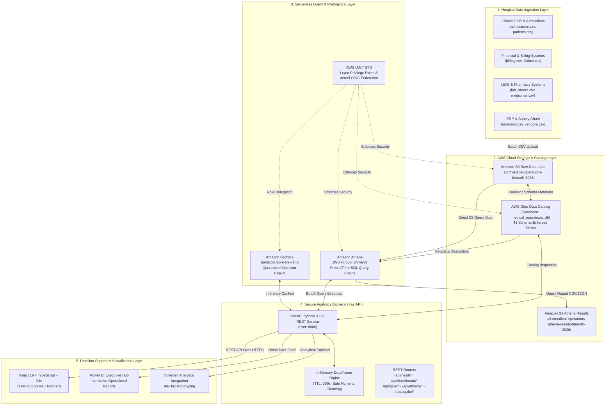
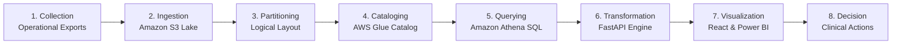
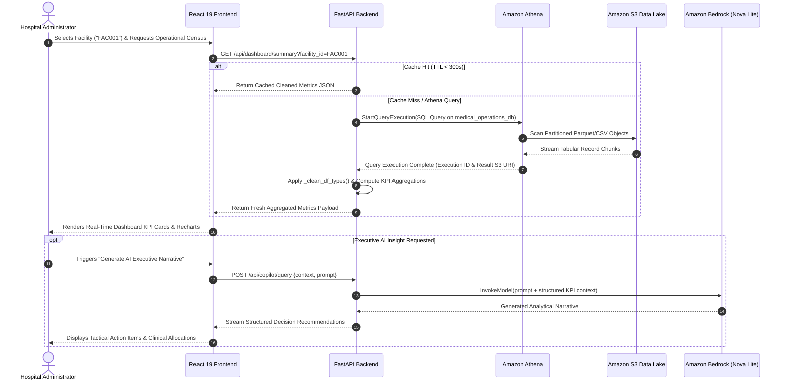

<div align="center">

# 🏥 MedOps Intelligence

### Healthcare Operations Intelligence & Decision Analytics Platform

*An enterprise-grade, cloud-native healthcare operations intelligence platform that centralizes distributed hospital data to drive high-impact operational analytics, executive decision-support, and predictive resource optimization.*

---

[](https://github.com/kummariBharath/Development-of-Healthcare-Operations-Intelligence-Dashboard-with-Decision-Analytics)
[](https://www.python.org/)
[](https://fastapi.tiangolo.com/)
[](https://react.dev/)
[](https://www.typescriptlang.org/)
[](https://vitejs.dev/)
[](https://aws.amazon.com/)
[](https://aws.amazon.com/s3/)
[-8C4FFF?style=for-the-badge&logo=amazonwebservices&logoColor=white)](https://aws.amazon.com/glue/)
[](https://aws.amazon.com/athena/)
[](https://aws.amazon.com/bedrock/)
[](https://powerbi.microsoft.com/)
[](https://streamlit.io/)
[](https://github.com/kummariBharath/Development-of-Healthcare-Operations-Intelligence-Dashboard-with-Decision-Analytics)
[](#-license)

<br/>


</div>

---

## 📑 Table of Contents

- [1. Executive Overview](#1-executive-overview)
- [2. Operational Challenge vs. Solution](#2-operational-challenge-vs-solution)
- [3. Key Platform Capabilities](#3-key-platform-capabilities)
- [4. End-to-End System Architecture](#4-end-to-end-system-architecture)
- [5. Data Engineering Workflow](#5-data-engineering-workflow)
- [6. AWS Cloud Infrastructure](#6-aws-cloud-infrastructure)
- [7. Healthcare Data Model (41 Tables)](#7-healthcare-data-model-41-tables)
- [8. Analytics & Metric Computation Layer](#8-analytics--metric-computation-layer)
- [9. Dashboard & Decision Support Modules](#9-dashboard--decision-support-modules)
- [10. End-to-End Project Workflow](#10-end-to-end-project-workflow)
- [11. Technology Stack](#11-technology-stack)
- [12. Repository Structure](#12-repository-structure)
- [13. Development Workflow & Engineering Standards](#13-development-workflow--engineering-standards)
- [14. Engineering Team](#14-engineering-team)
- [15. Security & Access Control](#15-security--access-control)
- [16. Data Privacy & Responsible Use](#16-data-privacy--responsible-use)
- [17. Getting Started](#17-getting-started)
- [18. AWS Deployment & Infrastructure Setup](#18-aws-deployment--infrastructure-setup)
- [19. Dashboard Preview & User Interface](#19-dashboard-preview--user-interface)
- [20. Key Engineering Highlights](#20-key-engineering-highlights)
- [21. Performance & Scalability Considerations](#21-performance--scalability-considerations)
- [22. Product Roadmap](#22-product-roadmap)
- [23. Engineering Principles](#23-engineering-principles)
- [24. Project Status](#24-project-status)
- [25. License](#25-license)
- [26. Acknowledgements & References](#26-acknowledgements--references)

---

## 1. Executive Overview

Modern healthcare networks generate colossal volumes of operational and clinical data across emergency services, inpatient admissions, surgical suites, pharmacy distribution, billing systems, and supply chains. However, this critical operational data frequently remains trapped within fragmented silos:

* **Siloed Departmental Systems**: Clinical EHR, laboratory information management systems (LIMS), ERPs, and billing platforms rarely communicate in real time.
* **Lagging Retrospective Reporting**: Hospital administration relies heavily on delayed, manually compiled spreadsheets that hinder timely tactical interventions.
* **Workforce Overburden & Bottlenecks**: Doctor and nursing schedules struggle to dynamically adapt to emergency spikes and unpredictable bed occupancy.
* **Revenue Leakage**: Coding discrepancies, insurance claim rejections, and prolonged unbilled accounts receivable reduce operating margins.

**MedOps Intelligence** solves this fundamental operational gap. It serves as a unified analytical engine that ingests, models, catalogs, and analyzes high-fidelity healthcare operational data across 5 multi-tier hospital facilities. Operating over a scalable AWS Data Lake foundation, the platform transforms raw transactional records into actionable KPIs, executive command visibility, and automated decision intelligence.

```
+----------------------------------------------------------------------------------------------------+
|                                    MEDOPS INTELLIGENCE ECOSYSTEM                                   |
|                                                                                                    |
|   41 Healthcare Datasets   -->   AWS S3 Data Lake   -->   AWS Glue Catalog   -->   Amazon Athena   |
|                                                                                         │          |
|   Executive Decision Making <-- React + Power BI BI <-- FastAPI Analytics Engine <───────┘          |
+----------------------------------------------------------------------------------------------------+
```

---

## 2. Operational Challenge vs. Solution

| Healthcare Operational Challenge | MedOps Intelligence Architectural Solution |
| :--- | :--- |
| **Fragmented Departmental Data** | Centralized, schema-enforced AWS Data Lake housing 41 relational operational domains in Amazon S3. |
| **Manual & Latent Reporting** | Automated serverless SQL queries executed via Amazon Athena delivering sub-second aggregated metrics. |
| **Executive Visibility Gaps** | Real-time Executive Command Center aggregating hospital-wide throughput, census, and revenue across 5 facilities. |
| **Unpredictable Bed Utilization** | Predictive bed occupancy monitoring tracking ICU admissions, departmental transfers, and average length of stay (ALOS). |
| **Workforce Scheduling Mismatches** | Comprehensive Doctor & Staff Intelligence correlating shift attendance, overtime, patient-nurse ratios, and burnout risks. |
| **Claims Denials & Financial Leakage** | Revenue Cycle Analytics uncovering top denial codes, outstanding accounts receivable, and net billing collections. |
| **Critical Stockouts & Supply Delays** | Pharmacy & Inventory Intelligence monitoring automated reorder thresholds, batch expirations, and vendor lead-times. |
| **Reactive Patient Experience Oversight** | Multi-channel Patient Experience analytics tracking Net Promoter Scores (NPS), CSAT ratings, and resolution workflows. |

---

## 3. Key Platform Capabilities

```
┌─────────────────────────────────────────────────────────────────────────────────────────────────┐
│                                MEDOPS CAPABILITY MATRIX                                         │
├───────────────────────────────┬───────────────────────────────┬─────────────────────────────────┤
│   🧭 EXECUTIVE COMMAND        │   👨‍⚕️ PATIENT OPERATIONS       │   👩‍⚕️ WORKFORCE INTELLIGENCE     │
│   • Hospital-wide throughput  │   • Admission & transfer flow │   • Doctor workload & shifts    │
│   • Multi-facility comparison │   • Bed occupancy rates       │   • Nurse-to-patient ratios     │
│   • Executive alerting        │   • Length of stay (ALOS)     │   • Overtime & burn-out metrics │
├───────────────────────────────┼───────────────────────────────┼─────────────────────────────────┤
│   💰 REVENUE CYCLE (RCM)      │   🧪 LAB & DIAGNOSTICS        │   💊 PHARMACY & INVENTORY       │
│   • Gross vs. Net billing     │   • Test order turnaround TAT │   • Stock depletion tracking    │
│   • Claims denial analytics   │   • Sample backlog monitoring │   • Automated reorder alerts    │
│   • Payer mix distribution    │   • Diagnostic modality usage │   • Prescription fulfillment    │
├───────────────────────────────┼───────────────────────────────┼─────────────────────────────────┤
│   📦 SUPPLY CHAIN & VENDORS   │   🛡️ QUALITY & COMPLIANCE     │   🤖 AI COPILOT & AUTOMATION    │
│   • Purchase order lifecycles │   • Incident root-cause logs  │   • Amazon Bedrock Copilot      │
│   • Vendor scorecards (OTD%)  │   • Corrective action tracking│   • Automated action triggers   │
│   • Critical inventory alerts │   • Regulatory compliance audit│   • Scenario modeling engine    │
└───────────────────────────────┴───────────────────────────────┴─────────────────────────────────┘
```

### Detailed Capability Breakdown

* **🧭 Executive Command Center**: Provides cross-facility benchmarking for 5 regional hospital facilities (`FAC001` to `FAC005`). Real-time tracking of admitted census, active bed occupancy percentage, emergency arrival surges, and revenue velocity.
* **👨‍⚕️ Patient Operations & Flow**: End-to-end admission-to-discharge tracking. Monitors Emergency Department (ED) triage acuity, ICU utilization, inpatient transfer delays, and discharge barriers.
* **👩‍⚕️ Workforce & Clinical Operations**: Evaluates doctor clinical loads, surgery schedules, nurse staffing ratios, and shift compliance to prevent clinical burnout and maintain staffing ratios.
* **💰 Revenue & Billing Intelligence**: Deep analysis of gross billed versus collected amounts, departmental revenue splits (Inpatient, Outpatient, ICU, Surgical), and payer claim status (Paid, In-Review, Denied).
* **🧪 Laboratory & Diagnostics Intelligence**: Tracks lab test volumes, order-to-result turnaround time (TAT), sample tracking across hematology, biochemistry, and microbiology, and equipment maintenance intervals.
* **💊 Pharmacy & Stock Management**: Inventory depletion tracking, batch expiration monitoring, prescription dispensing verification, and automated reorder alerts for critical medications.
* **📦 Supply Chain & Vendor Scorecards**: Purchase order lifecycle tracking, vendor on-time delivery (OTD) percentages, supplier quality ratings, and transaction cost variances.
* **🛡️ Quality, Safety & Regulatory Governance**: Comprehensive incident logging, patient safety indicators, audit compliance scores, corrective action tracking, and strict zero-trust role-based data governance.
* **😊 Patient Experience & Sentiment**: Real-time aggregation of CSAT, Net Promoter Score (NPS), wait time complaints, and departmental satisfaction ratings.
* **🤖 AI Copilot & Automation**: Intelligent decision support powered by Amazon Bedrock (`amazon.nova-lite-v1:0` / Claude 3.5 Sonnet) providing natural-language operational summaries and recommendations.

---

## 4. End-to-End System Architecture

The platform follows a decoupled, cloud-native architecture combining an S3-based data lake with a serverless query execution engine and a secure REST backend:



> [!IMPORTANT]
> **Production Boundary**: The architecture enforces strict client isolation. The browser-based React client never holds AWS access keys, secret keys, or IAM session tokens. All Athena queries and Bedrock invocations are mediated through authenticated FastAPI endpoints and validated against least-privilege IAM policies.

---

## 5. Data Engineering Workflow

The end-to-end data engineering pipeline transitions raw transactional records into high-value decision-support KPIs through an 8-phase workflow:



### Detailed Pipeline Phases

1. **Data Collection & Ingestion**: Operational exports across 41 healthcare domains are gathered in structured format and staged for cloud ingestion.
2. **Raw Storage Tier (Amazon S3)**: Files are stored in `s3://medical-operations-bharath-2026/` with immutable versioning, encryption at rest, and lifecycle management.
3. **Data Organization & Typing**: Columns are preserved with standard healthcare identifiers (`patient_id`, `facility_id`, `admission_id`), ISO-8601 timestamps, and standardized code sets.
4. **Metadata Cataloging (AWS Glue)**: The AWS Glue Data Catalog maintains exact schema definitions, column data types, and partition metadata within the `medical_operations_db` database.
5. **Serverless SQL Layer (Amazon Athena)**: Athena provides distributed, serverless SQL query capability directly against S3 datasets without requiring persistent database clusters.
6. **Data Transformation & Metric Computing (FastAPI)**: The backend executes targeted SQL aggregations, applies safe numeric coercion (`_safe_sum`, `_safe_mean`), handles missing values, and calculates clinical indicators.
7. **Visualization Layer (React + Power BI + Streamlit)**: High-performance data feeds power dynamic charts, KPI cards, interactive tables, and executive scorecards.
8. **Decision Support & Tactical Action**: Operations directors and department heads leverage computed insights to rebalance staff, expedite patient discharge, and clear supply bottlenecks.

---

## 6. AWS Cloud Infrastructure

The platform leverages a streamlined, cost-effective serverless architecture on Amazon Web Services:

| AWS Service | Configuration in MedOps | Purpose & Architecture Role |
| :--- | :--- | :--- |
| **Amazon S3** | `s3://medical-operations-bharath-2026`<br/>`ap-south-1` (Mumbai) | Primary cloud data lake storage for all 41 operational datasets. Encrypted at rest. |
| **Amazon S3 (Results)** | `s3://medical-operations-athena-results-bharath-2026/` | Dedicated S3 output bucket for Amazon Athena query execution results and execution manifests. |
| **AWS Glue** | Database: `medical_operations_db`<br/>`ap-south-2` (Hyderabad) | Centralized metadata repository and Data Catalog managing schema definitions across all 41 tables. |
| **Amazon Athena** | Workgroup: `primary`<br/>Engine: Presto / Trino Serverless | Serverless distributed query engine executing SQL over S3 without operational server overhead. |
| **Amazon Bedrock** | Model: `amazon.nova-lite-v1:0`<br/>Region: `us-east-1` (N. Virginia) | Foundation model inference engine generating operational narratives and automated copilot summaries. |
| **AWS IAM / STS** | Policies: `policy-v2.json`, `ecs-task-permissions-policy.json` | Fine-grained, least-privilege role policies and Vercel OIDC temporary credential exchange. |

### IAM Policy Architecture

Access control is governed by an explicit least-privilege IAM policy:

```json
{
  "Version": "2012-10-17",
  "Statement": [
    {
      "Sid": "S3ProjectData",
      "Effect": "Allow",
      "Action": ["s3:GetObject", "s3:ListBucket", "s3:GetBucketLocation"],
      "Resource": [
        "arn:aws:s3:::medical-operations-bharath-2026",
        "arn:aws:s3:::medical-operations-bharath-2026/*"
      ]
    },
    {
      "Sid": "S3AthenaResults",
      "Effect": "Allow",
      "Action": [
        "s3:GetObject", "s3:PutObject", "s3:ListBucket",
        "s3:GetBucketLocation", "s3:AbortMultipartUpload"
      ],
      "Resource": [
        "arn:aws:s3:::medical-operations-athena-results-bharath-2026",
        "arn:aws:s3:::medical-operations-athena-results-bharath-2026/*"
      ]
    },
    {
      "Sid": "AthenaAnalytics",
      "Effect": "Allow",
      "Action": [
        "athena:StartQueryExecution", "athena:GetQueryExecution",
        "athena:GetQueryResults", "athena:StopQueryExecution", "athena:GetWorkGroup"
      ],
      "Resource": "*"
    },
    {
      "Sid": "GlueCatalog",
      "Effect": "Allow",
      "Action": [
        "glue:GetDatabase", "glue:GetDatabases",
        "glue:GetTable", "glue:GetTables", "glue:GetPartitions"
      ],
      "Resource": "*"
    },
    {
      "Sid": "BedrockInference",
      "Effect": "Allow",
      "Action": ["bedrock:InvokeModel", "bedrock:InvokeModelWithResponseStream"],
      "Resource": "*"
    }
  ]
}
```

---

## 7. Healthcare Data Model (41 Tables)

The underlying dataset comprises **41 relational tables** modeled across the healthcare operational lifecycle. All 41 tables are cataloged in AWS Glue and queryable via Athena:

```
┌─────────────────────────────────────────────────────────────────────────────────────────────────┐
│                           HEALTHCARE DATA MODEL - 41 CORE DATASETS                              │
├───────────────────────────────────┬─────────────────────────────────────────────────────────────┤
│ 1. Patient & Inpatient Flow (9)   │ patients · admissions · appointments · beds                 │
│                                   │ bed_movements · discharge_records · emergency_visits        │
│                                   │ icu_stays · patient_flow_events                             │
├───────────────────────────────────┼─────────────────────────────────────────────────────────────┤
│ 2. Clinical & Workforce (9)       │ doctors · doctor_workload · staff · staff_workload          │
│                                   │ staff_attendance · nurse_shifts · surgeries                 │
│                                   │ departments · facilities                                    │
├───────────────────────────────────┼─────────────────────────────────────────────────────────────┤
│ 3. Diagnostics & Pharmacy (8)     │ lab_orders_results · lab_samples · lab_tests                │
│                                   │ lab_equipment · medicines · medicine_batches                │
│                                   │ prescriptions · pharmacy_dispensing                         │
├───────────────────────────────────┼─────────────────────────────────────────────────────────────┤
│ 4. Revenue Cycle & Finance (4)    │ billing · claims · financial_expenses · financial_monthly   │
├───────────────────────────────────┼─────────────────────────────────────────────────────────────┤
│ 5. Supply Chain & Vendors (6)     │ inventory · inventory_transactions · purchase_orders         │
│                                   │ supply_chain_purchase_orders · vendors · vendor_performance │
├───────────────────────────────────┼─────────────────────────────────────────────────────────────┤
│ 6. Quality, Experience & Safety(5)│ quality_audits · quality_incidents · corrective_actions     │
│                                   │ patient_feedback · patient_complaints                       │
└───────────────────────────────────┴─────────────────────────────────────────────────────────────┘
```

### Facilities Represented in Dataset

The multi-facility operational model spans 5 primary hospital networks:
1. `FAC001` — **Hyderabad Central Hospital** (Hyderabad, Telangana)
2. `FAC002` — **Hyderabad West Clinic** (Hyderabad, Telangana)
3. `FAC003` — **Secunderabad Medical Center** (Secunderabad, Telangana)
4. `FAC004` — **Bengaluru Care Hospital** (Bengaluru, Karnataka)
5. `FAC005` — **Chennai Health Center** (Chennai, Tamil Nadu)

---

## 8. Analytics & Metric Computation Layer

The analytics service converts raw tabular rows into validated healthcare metrics using defensive aggregation pipelines:

```
Raw S3 Data Records
        ↓
AWS Glue Metadata Cataloging
        ↓
Amazon Athena SQL Queries (Aggregations & Filtering)
        ↓
FastAPI Type Sanitization (_safe_sum, _safe_mean, _to_num)
        ↓
Clinical & Financial KPI Formulation
        ↓
REST Response Serialization (JSON)
        ↓
Executive Decision Intelligence
```

### Core Computed KPIs & Mathematical Formulations

* **Bed Occupancy Rate (%)**:
  $$\text{Occupancy Rate} = \left(\frac{\text{Occupied Inpatient Beds}}{\text{Total Operational Bed Capacity}}\right) \times 100$$
* **Average Length of Stay (ALOS)**:
  $$\text{ALOS} = \frac{\sum_{i=1}^{N} (\text{Discharge Date}_i - \text{Admission Date}_i)}{N_{\text{discharges}}}$$
* **Claims Denial Rate (%)**:
  $$\text{Denial Rate} = \left(\frac{\text{Count of Denied Claims}}{\text{Total Claims Submitted}}\right) \times 100$$
* **Emergency Department Throughput & Wait Time**:
  $$\text{Avg ED Wait} = \frac{\sum (\text{Triage Time} - \text{Arrival Time})}{N_{\text{emergency visits}}}$$
* **Doctor Workload Index**:
  $$\text{Workload Index} = \sum (\text{Appointments Handled} \times w_1) + (\text{Surgeries Performed} \times w_2) + (\text{Inpatient Rounds} \times w_3)$$
* **Lab Test Turnaround Time (TAT)**:
  $$\text{Avg TAT (Hours)} = \frac{\sum (\text{Result Timestamp} - \text{Order Timestamp})}{N_{\text{completed tests}}}$$
* **Net Collection Ratio (%)**:
  $$\text{Net Collection Ratio} = \left(\frac{\text{Total Paid / Collected Amount}}{\text{Net Billed Amount}}\right) \times 100$$
* **Vendor On-Time Delivery (OTD %)**:
  $$\text{OTD \%} = \left(\frac{\text{Purchase Orders Delivered on or before Due Date}}{\text{Total Completed Purchase Orders}}\right) \times 100$$

---

## 9. Dashboard & Decision Support Modules

The frontend is architected as an interconnected command suite spanning 21 dedicated operational modules:

```
+───────────────────────────────────────────────────────────────────────────+
|                           MEDOPS COMMAND SUITE                            |
+───────────────────────────────────────────────────────────────────────────+
| 01. Executive Command Center         11. Emergency & Critical Ops (Live)  |
| 02. Patient Operations               12. Quality & Regulatory Compliance  |
| 03. Doctor & Staff Intelligence      13. Patient Experience & Sentiment   |
| 04. Billing & Revenue Intelligence   14. Supply Chain & Vendor Scorecards |
| 05. Insurance & Claims Automation    15. Financial Intelligence (P&L)     |
| 06. Medical Coding & Documentation   16. Medical Operations AI Agent      |
| 07. AI & Predictive Intelligence     17. Executive Power BI Hub           |
| 08. Workflow Automation Engine       18. Security & Governance (IAM/Audit)|
| 09. Pharmacy & Drug Inventory        19. Enterprise Integrations Hub      |
| 10. Laboratory & Diagnostics         20. Data -> AI -> Automation Pipeline|
|                                      21. AWS Cloud Services Hub           |
+───────────────────────────────────────────────────────────────────────────+
```

### Module Highlights

| Module | Primary Visualizations & Controls | Tactical Impact |
| :--- | :--- | :--- |
| **Executive Center** | High-level KPI cards, census trend lines, multi-facility comparative heatmaps. | Instant visibility for Chief Medical Officers (CMO) and Chief Operating Officers (COO). |
| **Patient Ops** | Admission vs. discharge curves, bed occupancy progress bars, ALOS distributions. | Minimizes inpatient bottlenecks and reduces avoidable discharge delays. |
| **Workforce** | Doctor load distributions, nurse-to-patient ratio monitors, overtime trackers. | Optimizes clinical shift scheduling and mitigates healthcare provider burnout. |
| **Billing & Claims** | Gross billed vs. net collections, payer denial breakdown, aging receivables. | Accelerates cash flow recovery and uncovers recurring denial root causes. |
| **Emergency Ops** | Triage level distributions (ESI 1-5), ambulance bay arrivals, waiting time gauges. | Balances critical care resources during unexpected mass-casualty surges. |
| **Pharmacy & Lab** | Stock-out warning lists, batch expiration alerts, lab order TAT gauges. | Guarantees medication availability and diagnostic turnaround targets. |
| **AWS Cloud Hub** | Live Glue schema browser, interactive Athena SQL query console, AWS health status. | Provides full auditability of underlying cloud queries and data lineage. |

---

## 10. End-to-End Project Workflow



---

## 11. Technology Stack

<div align="center">

[](https://skillicons.dev)

</div>

### Technology Breakdown

* **Programming & Core Languages**:
  * **Python (3.10 / 3.12 / 3.14)**: Core backend runtime powering FastAPI, Boto3, and data processing.
  * **TypeScript (5.x / 6.x)**: Type-safe enterprise frontend application architecture.
  * **SQL (Presto / Trino Dialect)**: Distributed analytical queries executed over Amazon Athena.
* **Backend Architecture & Frameworks**:
  * **FastAPI (v4.2.0)**: Asynchronous REST API framework with automatic OpenAPI documentation.
  * **Uvicorn**: High-performance ASGI web server.
  * **Pydantic**: Robust runtime request/response validation and configuration management.
  * **Pandas**: Fast in-memory data transformation, sanitization, and metric aggregation.
  * **Boto3**: Official AWS SDK for Python mediating S3, Glue, Athena, Bedrock, and STS.
* **Frontend & Visualization**:
  * **React 19**: Modern declarative component architecture with hooks and concurrent features.
  * **Vite 8**: Next-generation lightning-fast frontend tooling and bundle pipeline.
  * **Tailwind CSS v4**: Utility-first responsive styling system.
  * **Recharts**: Composable charting library for responsive time-series, bar, and area charts.
  * **Lucide React**: High-clarity medical and operational iconography.
  * **Framer Motion**: Smooth interface transitions and modal animations.
* **Cloud & Data Engineering (AWS)**:
  * **Amazon S3**: Scalable object storage holding 41 raw CSV datasets and Athena query results.
  * **AWS Glue**: Managed data catalog establishing database metadata across 41 tables.
  * **Amazon Athena**: Serverless interactive query service for zero-infrastructure SQL analytics.
  * **Amazon Bedrock**: Managed generative AI service hosting `amazon.nova-lite-v1:0` and Claude 3.5 Sonnet.
  * **AWS STS / IAM**: Secure token service enabling Vercel OIDC identity federation.
* **Business Intelligence & Portals**:
  * **Power BI Embedded Hub**: Executive dashboard hub for interactive enterprise reporting.
  * **Streamlit Compatibility**: Modular architecture designed for seamless Python analytical prototyping.
* **DevOps & Containerization**:
  * **Docker**: Multi-stage lightweight Linux containerization (`python:3.12-slim`).
  * **AWS ECR / ECS**: Production task policies and trust definitions for scalable container orchestration.
  * **Vercel**: Edge frontend hosting with automatic OIDC credential exchange for AWS.

---

## 12. Repository Structure

The repository maintains strict separation of concerns across backend services, frontend presentation components, infrastructure policies, and data assets:

```text
Development-of-Healthcare-Operations-Intelligence-Dashboard-with-Decision-Analytics/
├── .docker-ecr/                           # ECR configuration descriptors
│   └── config.json
├── backend/                               # FastAPI Python Backend Service
│   ├── app/
│   │   ├── aws/                           # Boto3 Cloud Connectors & Client Factories
│   │   │   ├── athena.py                  # Athena query execution & result polling
│   │   │   ├── bedrock.py                 # Amazon Bedrock LLM copilot invocation
│   │   │   ├── glue.py                    # AWS Glue Data Catalog table inspectors
│   │   │   ├── s3.py                      # S3 bucket health & object scanners
│   │   │   └── session.py                 # Multi-region session & Vercel OIDC STS logic
│   │   ├── routes/                        # Modular FastAPI REST Endpoint Routers
│   │   │   ├── athena.py                  # Raw Athena query execution API
│   │   │   ├── copilot.py                 # Bedrock decision-support copilot API
│   │   │   ├── dashboard.py               # 20+ healthcare intelligence REST endpoints
│   │   │   ├── glue.py                    # Glue Data Catalog metadata API
│   │   │   └── health.py                  # Multi-service cloud health probe
│   │   ├── services/                      # Analytical Core & Computation Engines
│   │   │   ├── copilot_service.py         # AI prompt crafting & context serialization
│   │   │   └── dashboard_service.py       # 3,300+ lines of robust metric aggregations
│   │   ├── config.py                      # Environment settings & region configurations
│   │   └── main.py                        # FastAPI application entrypoint & middleware
│   ├── Dockerfile                         # Container build definition for backend
│   └── requirements.txt                   # Python dependencies (FastAPI, Boto3, Pandas)
├── dataset/                               # Healthcare Operational Data Assets
│   └── medical_operations_core_v9_100k/   # 41 Relational CSV Tables (100k records)
│       ├── admissions.csv
│       ├── appointments.csv
│       ├── billing.csv
│       ├── claims.csv
│       ├── doctors.csv
│       ├── facilities.csv
│       ├── inventory.csv
│       ├── lab_orders_results.csv
│       ├── medicines.csv
│       ├── patients.csv
│       └── ... (41 CSV datasets total)
├── public/                                # Static Web Assets
│   ├── favicon.svg
│   └── icons.svg
├── src/                                   # React 19 + TypeScript Frontend Source
│   ├── assets/
│   │   └── hero.png                       # Dashboard preview graphic
│   ├── components/
│   │   ├── copilot/                       # AI Copilot floating drawer & chat UI
│   │   │   └── AICopilot.tsx
│   │   ├── layout/                        # Core application shell
│   │   │   ├── Header.tsx                 # Facility filter & status indicators
│   │   │   └── Sidebar.tsx                # 21-module grouped navigation sidebar
│   │   ├── modals/                        # Drilldown & interactive dialogs
│   │   │   ├── AlertsModal.tsx
│   │   │   ├── CustomKPIModal.tsx
│   │   │   └── EnterpriseDrilldownModal.tsx
│   │   └── modules/                       # 21 Healthcare Intelligence Views
│   │       ├── AIPredictiveIntelligence.tsx
│   │       ├── AutomationPipelineVisualizer.tsx
│   │       ├── AWSCloudServicesHub.tsx    # Live Athena console & Glue browser
│   │       ├── BillingRevenueIntelligence.tsx
│   │       ├── DoctorStaffIntelligence.tsx
│   │       ├── EmergencyCriticalOperations.tsx
│   │       ├── ExecutiveCommandCenter.tsx # Primary executive view
│   │       ├── FinancialIntelligence.tsx
│   │       ├── InsuranceClaimsAutomation.tsx
│   │       ├── IntegrationsHub.tsx
│   │       ├── LaboratoryDiagnostics.tsx
│   │       ├── MedicalCodingDocumentation.tsx
│   │       ├── MedicalOpsAIAgentTab.tsx
│   │       ├── PatientExperience.tsx
│   │       ├── PatientOperations.tsx
│   │       ├── PharmacyInventory.tsx
│   │       ├── PowerBIDashboardHub.tsx    # Power BI embedded view
│   │       ├── QualityCompliance.tsx
│   │       ├── SecurityGovernance.tsx
│   │       ├── SupplyChainVendor.tsx
│   │       └── WorkflowAutomationEngine.tsx
│   ├── data/
│   │   └── mockData.ts                    # Offline fallback datasets
│   ├── services/
│   │   ├── apiService.ts                  # REST API client connecting to FastAPI
│   │   └── awsService.ts                  # Client-side AWS interfaces
│   ├── types/
│   │   └── index.ts                       # Shared TypeScript domain interfaces
│   ├── App.css
│   ├── App.tsx                            # Root application component & routing
│   ├── index.css                          # Tailwind CSS imports & theme tokens
│   └── main.tsx                           # React DOM mount point
├── ecs-infrastructure-trust-policy.json   # AWS ECS infrastructure trust policy
├── ecs-task-permissions-policy.json       # AWS ECS task IAM permissions policy
├── ecs-task-role-trust-policy.json        # AWS ECS task role trust policy
├── ecs-task-trust-policy.json             # AWS ECS execution role trust policy
├── policy.json                            # IAM Policy v1
├── policy-v2.json                         # Enhanced IAM Policy with S3 Athena Results
├── package.json                           # Frontend Node.js dependencies & scripts
├── vercel.json                            # Vercel deployment routing & headers
├── vite.config.ts                         # Vite build configuration & plugins
└── README.md                              # Project documentation
```

---

## 13. Development Workflow & Engineering Standards

The project follows a standard GitHub Flow model designed for team velocity, automated code quality checks, and clean version control:

```
Main Branch (Production)
       │
       ├──> Create Feature Branch (`feature/analytics-enhancement`)
       │           │
       │           ├──> Implement Changes & Clean Code
       │           ├──> Run Static Linters (`oxlint`, `mypy`)
       │           ├──> Commit with Conventional Commits
       │           └──> Push to GitHub
       │
       └──> Open Pull Request (PR) -> Peer Code Review -> Merge to Main
```

### Git Feature Branch Example

```bash
# 1. Clone repository
git clone https://github.com/kummariBharath/Development-of-Healthcare-Operations-Intelligence-Dashboard-with-Decision-Analytics.git
cd Development-of-Healthcare-Operations-Intelligence-Dashboard-with-Decision-Analytics

# 2. Create and switch to a descriptive feature branch
git checkout -b feature/optimize-athena-queries

# 3. Develop, format, and lint
npm run lint

# 4. Commit using Conventional Commit specifications
git add .
git commit -m "feat(analytics): add adaptive polling interval to Athena query execution"

# 5. Push to origin and open a Pull Request
git push origin feature/optimize-athena-queries
```

### Commit Message Standards

Commits adhere to the [Conventional Commits](https://www.conventionalcommits.org/) specification:
* `feat:` A new user-facing capability or API endpoint
* `fix:` A bug fix or data typing resolution
* `refactor:` Code restructuring without behavioral change
* `docs:` Documentation improvements or diagram updates
* `perf:` Performance optimizations in queries or frontend rendering
* `chore:` Build scripts, dependency bumps, or tool adjustments

---

## 14. Engineering Team

| Team Member | Engineering Role | Focus Areas | GitHub Profile |
| :--- | :--- | :--- | :--- |
| **Kummari Bharath** | Project Lead & Cloud Architect | Cloud Architecture, Data Engineering, FastAPI Backend, AWS Glue & Athena | [@kummariBharath](https://github.com/kummariBharath) |
| **Engineering Contributor** | Data & Analytics Engineer | Healthcare Data Modeling, Athena SQL Queries, Metric Computation | *Open for Collaboration* |
| **Frontend Contributor** | Full-Stack UI/UX Engineer | React 19, Tailwind CSS, Recharts Visualization, Power BI Hub | *Open for Collaboration* |

---

## 15. Security & Access Control

The MedOps Intelligence architecture implements **Zero-Trust Principles** and enforces strict credential isolation:

```
┌────────────────────────────────────────────────────────────────────────────────────────┐
│                              SECURITY PERIMETER & ISOLATION                            │
├────────────────────────────────────────────────────────────────────────────────────────┤
│  [ Web Browser / Client ]                                                              │
│       │                                                                                │
│       │ (No AWS Access Keys · No S3 Bucket Secrets · No Athena Tokens)                 │
│       ▼                                                                                │
│  [ FastAPI Backend Layer ]                                                             │
│       │                                                                                │
│       ├──> Vercel Deployment: Short-lived OIDC Token exchange via AWS STS             │
│       └──> Container / Local: Environment variables via backend/.env or IAM Role      │
│       ▼                                                                                │
│  [ AWS Cloud Boundary (IAM Policy Least-Privilege) ]                                   │
│       ├──> Amazon S3: Read-only access to raw bucket; Write-only to query results      │
│       ├──> AWS Glue: Read-only access to catalog schemas                               │
│       ├──> Amazon Athena: Restricted to designated workgroup                           │
│       └──> Amazon Bedrock: Restricted model invocation permissions                     │
└────────────────────────────────────────────────────────────────────────────────────────┘
```

### Security Safeguards

1. **Zero Client-Side Credentials**: AWS Access Keys, Secret Keys, and Session Tokens are strictly forbidden in client-side code, JavaScript bundles, or URL parameters.
2. **Short-Lived OIDC Authentication**: In cloud deployments on Vercel, the backend automatically exchanges short-lived Vercel OIDC identity tokens for temporary AWS STS credentials (`assume_role_with_web_identity`), eliminating static secret storage entirely.
3. **IAM Least Privilege**: All IAM policies explicitly scope permissions to specific bucket ARNs (`arn:aws:s3:::medical-operations-bharath-2026`) and read-only Glue catalog actions.
4. **Environment Exclusion**: Real `.env` and `.env.local` files containing runtime secrets are strictly excluded from git tracking via `.gitignore`.

> [!CAUTION]
> **Cloud Security Rule**: Never commit AWS credentials, API keys, private tokens, or database passwords into GitHub. Always utilize environment variables, IAM roles, or AWS Secrets Manager.

---

## 16. Data Privacy & Responsible Use

Given the healthcare orientation of this platform, rigorous data governance principles are upheld:

* **Synthetic Data Guarantee**: All 100,000 records across the 41 CSV tables (`admissions.csv`, `patients.csv`, `billing.csv`, etc.) represent **fully synthetic, de-identified data generated strictly for benchmarking, decision-analytics demonstration, and educational purposes**.
* **Zero Protected Health Information (PHI)**: No real patient names, social security numbers, government IDs, actual medical records, or live institutional patient charts are present in this repository.
* **Demonstration Scope**: This repository represents an operational prototype and reference architecture. Production deployment in a live clinical setting requires formal HIPAA / GDPR compliance validation, business associate agreements (BAAs) with AWS, and audit logging via AWS CloudTrail.

---

## 17. Getting Started

Follow these steps to run MedOps Intelligence locally on your workstation.

### Prerequisites

* **Python**: v3.10, v3.12, or v3.14 installed
* **Node.js**: v18.x or v20.x+ and `npm` installed
* **Git**: Installed and configured
* *(Optional)* **AWS CLI**: Configured with credentials if connecting to live AWS S3, Glue, and Athena. If AWS credentials are not configured, the platform automatically utilizes its built-in local dataset engine.

---

### Step 1: Clone the Repository

```bash
git clone https://github.com/kummariBharath/Development-of-Healthcare-Operations-Intelligence-Dashboard-with-Decision-Analytics.git
cd Development-of-Healthcare-Operations-Intelligence-Dashboard-with-Decision-Analytics
```

---

### Step 2: Set Up & Launch the FastAPI Backend

Open a terminal and navigate to the `backend/` directory:

```bash
cd backend

# Create a virtual environment
python -m venv venv

# Activate the virtual environment
# Windows (PowerShell):
venv\Scripts\Activate.ps1
# Linux / macOS:
source venv/bin/activate

# Install Python dependencies
pip install -r requirements.txt

# Launch FastAPI development server
python -m uvicorn app.main:app --host 127.0.0.1 --port 8000 --reload
```

* Backend API will be live at: `http://127.0.0.1:8000`
* Interactive Swagger API documentation: `http://127.0.0.1:8000/docs`
* Multi-service health probe: `http://127.0.0.1:8000/api/health`

---

### Step 3: Set Up & Launch the React Frontend

Open a second terminal in the project root:

```bash
# Install frontend dependencies
npm install

# Start the Vite development server
npm run dev
```

* Application will be available at: `http://localhost:5173`

---

## 18. AWS Deployment & Infrastructure Setup

To connect the platform to your own AWS Cloud environment, follow this deployment sequence:

### 1. Amazon S3 Setup
* Create an S3 bucket for the data lake: `s3://your-hospital-operations-bucket/`
* Create a dedicated query results bucket: `s3://your-hospital-athena-results/`
* Upload the 41 CSV files from `dataset/medical_operations_core_v9_100k/` into individual folders named after each table (e.g., `s3://your-hospital-operations-bucket/admissions/admissions.csv`).

### 2. AWS Glue Cataloging
* Navigate to **AWS Glue** > **Databases** > Create database `medical_operations_db`.
* Create and run an **AWS Glue Crawler** targeting `s3://your-hospital-operations-bucket/`, or define table schemas directly matching the column structures in the CSV files.

### 3. Amazon Athena Configuration
* Open **Amazon Athena** > **Settings** > Set **Query Result Location** to `s3://your-hospital-athena-results/`.
* Verify that the workgroup `primary` is active.
* Test query execution:
  ```sql
  SELECT facility_id, count(*) AS total_admissions, avg(length_of_stay_days) AS avg_los
  FROM "medical_operations_db"."admissions"
  GROUP BY facility_id;
  ```

### 4. Amazon Bedrock Access
* In the AWS Bedrock console, request model access for `amazon.nova-lite-v1:0` or Anthropic Claude 3.5 Sonnet in your target region (`us-east-1`).

### 5. Backend Configuration (`backend/.env`)
Create `backend/.env` with your cloud identifiers:

```ini
AWS_REGION=ap-south-1
AWS_S3_REGION=ap-south-1
AWS_DATA_REGION=ap-south-2
AWS_BEDROCK_REGION=us-east-1

AWS_S3_BUCKET=your-hospital-operations-bucket
AWS_GLUE_DATABASE=medical_operations_db
AWS_ATHENA_WORKGROUP=primary
AWS_ATHENA_OUTPUT=s3://your-hospital-athena-results/
AWS_BEDROCK_MODEL=amazon.nova-lite-v1:0

# Optional: If running outside AWS IAM Roles / Vercel OIDC
# AWS_ACCESS_KEY_ID=your_access_key
# AWS_SECRET_ACCESS_KEY=your_secret_key
```

---

## 19. Dashboard Preview & User Interface

The MedOps Intelligence interface is engineered with a dark-mode enterprise clinical theme, combining high data density with visual clarity:

<div align="center">

| Module | Interface Preview | Key Metrics Displayed |
| :--- | :---: | :--- |
| **Executive Command Center** |  | Total Census, Bed Occupancy %, Net Revenue, Open Incidents |
| **AWS Cloud Services Hub** | *(Interactive Component)* | Glue Catalog Tables, Schema Inspector, Real-time Athena Query Runner |
| **Revenue Cycle & Claims** | *(Interactive Component)* | Total Billed, Denial Rate %, Top Denial Reasons, Payer Breakdown |
| **Emergency Operations** | *(Interactive Component)* | Triage Level Distribution, Ambulance Bay Traffic, Average ED Wait |

</div>

---

## 20. Key Engineering Highlights

* ☁️ **Cloud Data Lake Architecture**: Seamlessly scales from local developer environments to multi-region AWS S3 storage with AWS Glue cataloging.
* 🔎 **Serverless SQL Engine**: Zero database server management costs via Amazon Athena on-demand query execution with execution tracking and data scan measurement.
* 🔐 **Enterprise Identity Federation**: Implements short-lived Vercel OIDC-to-AWS STS credential exchange for zero-hardcoded secret production deployments.
* 📊 **41-Domain Healthcare Relational Model**: Spans admissions, emergency visits, lab results, surgical schedules, inventory, and vendor scorecards.
* 🤖 **Bedrock Decision Support**: Context-aware AI Copilot providing executive narrative summaries and tactical action suggestions.
* ⚡ **Sub-Second Dashboard Response**: In-memory analytical caching layer (300s TTL) with defensive type sanitization ensuring high availability and fast rendering.
* 📈 **Decision Analytics Over Raw Reporting**: Features automated KPIs, including Doctor Workload Indices, On-Time Delivery rates, and Net Collection Ratios.
* 🧩 **Modular Component Design**: Clean, maintainable React 19 architecture structured into 21 independent modules with Lucide icons and Tailwind CSS v4.

---

## 21. Performance & Scalability Considerations

To scale MedOps Intelligence across enterprise hospital networks processing millions of operational records, the platform incorporates key architectural optimization pathways:

```
+─────────────────────────────────────────────────────────────────────────────────────────────────+
|                                    SCALABILITY ROADMAP                                          |
+───────────────────────────────┬─────────────────────────────────┬───────────────────────────────+
|   STORAGE OPTIMIZATION        |   SERVERLESS QUERY PERFORMANCE  |   API & DASHBOARD ACCELERATION|
│   • Partitioning by facility  │   • Query result reuse cache    │   • Multi-tier in-memory TTL  │
│     and date (year/month)     │   • Column projection pruning   │   • Edge response caching     │
│   • Conversion from CSV to    │   • Workgroup data limits and   │   • Virtualized tables for    │
│     Snappy-compressed Parquet │     cost governance alerts      │     high-cardinality listings │
+───────────────────────────────┴─────────────────────────────────┴───────────────────────────────+
```

1. **Partitioning Strategy**: Partitioning S3 data by `facility_id` and `event_date` (`year=YYYY/month=MM/`) enables Athena queries to scan only targeted partitions, reducing query time and AWS data scan costs by up to 90%.
2. **Columnar Parquet Storage**: Migrating historical raw CSV records to columnar Apache Parquet with Snappy compression minimizes storage footprint and accelerates Presto/Trino columnar scan speeds.
3. **In-Memory Cache Layer**: The FastAPI service maintains a thread-safe DataFrame cache with a 300-second TTL to prevent redundant Athena query executions during high-frequency dashboard reloads.
4. **Defensive Type Coercion**: Customized `_clean_df_types()` logic converts string-encoded currency amounts and quantities to native 64-bit numerics, preventing runtime string concatenation errors during aggregation.

---

## 22. Product Roadmap

### Phase 1 — Core Data Lake & Analytics Platform `[COMPLETED]`
- [x] Ingestion & modeling of 41 healthcare operational datasets
- [x] AWS S3 Data Lake configuration with Glue Data Catalog integration
- [x] Amazon Athena serverless SQL execution pipeline with data scan metrics
- [x] FastAPI REST backend with defensive numeric aggregation and caching
- [x] React 19 + TypeScript + Tailwind CSS executive frontend suite
- [x] AWS Cloud Services Hub with live Glue schema inspector and Athena console
- [x] Zero-credentials Vercel OIDC identity federation with AWS STS

### Phase 2 — Decision Analytics & Automation `[IN PROGRESS]`
- [ ] Automated anomaly detection on emergency department arrival spikes
- [ ] Automated email/SMS alerting triggers for low pharmacy inventory thresholds
- [ ] Power BI DirectQuery integration via Athena ODBC/JDBC drivers
- [ ] Parquet conversion pipeline automated via AWS Glue ETL jobs
- [ ] Role-based access control (RBAC) tiers for Department Heads vs. Executive Board

### Phase 3 — Real-Time Streaming & Enterprise Scale `[PLANNED]`
- [ ] Apache Kafka / Amazon Kinesis stream ingestion for real-time telemetry
- [ ] Machine learning models for patient readmission risk prediction
- [ ] Multi-hospital federated analytics across regional healthcare systems
- [ ] Automated clinical staffing optimization based on predictive census forecasts

---

## 23. Engineering Principles

The codebase and architecture adhere to strict core software engineering values:

* **Modularity**: Every module, router, and cloud connector is decoupled and adheres to the Single Responsibility Principle (SRP).
* **Least Privilege (PoLP)**: IAM roles and API scopes provide only the exact permissions needed for designated operations.
* **Separation of Concerns**: Complete decoupling of data storage (S3), metadata cataloging (Glue), query execution (Athena), business logic (FastAPI), and presentation (React).
* **Defensive Programming**: Resilient data handling with fallback dataset loading, NaN sanitization, and graceful degradation during cloud connectivity interruptions.
* **Reproducibility**: Clear environment variable contracts, containerized Docker builds, and deterministic setup steps.

---

## 24. Project Status


MedOps Intelligence is under **Active Engineering Development**. The core data lake, cataloging, serverless SQL query pipeline, FastAPI backend services, and 21-module React command center are fully implemented and functional. Ongoing work focuses on streaming ingestion, automated anomaly detection, and predictive clinical staffing models.

---

## 25. License

**License**: Proprietary / To Be Defined.  
All rights reserved by the repository maintainer. Usage guidelines, licensing terms, and distribution rights are currently under definition. For academic review, partnership, or enterprise demonstration inquiries, please contact the author.

---

## 26. Acknowledgements & References

* **AWS Architecture Documentation**: Best practices from AWS Big Data and Serverless Analytics reference architectures (Amazon S3, AWS Glue, Amazon Athena).
* **FastAPI Framework**: [FastAPI Documentation](https://fastapi.tiangolo.com/) by Sebastián Ramírez.
* **React & Vite**: [React](https://react.dev/) by Meta Open Source and [Vite](https://vitejs.dev/) by Evan You.
* **Healthcare Operations Analytics**: Industry benchmark metrics informed by the Healthcare Financial Management Association (HFMA) and Emergency Severity Index (ESI) triage protocols.

---

<div align="center">

Built with rigorous data engineering, cloud architecture, and modern analytics.

**Maintainer**: [Kummari Bharath](https://github.com/kummariBharath) · [MedOps Intelligence Repository](https://github.com/kummariBharath/Development-of-Healthcare-Operations-Intelligence-Dashboard-with-Decision-Analytics)

</div>
