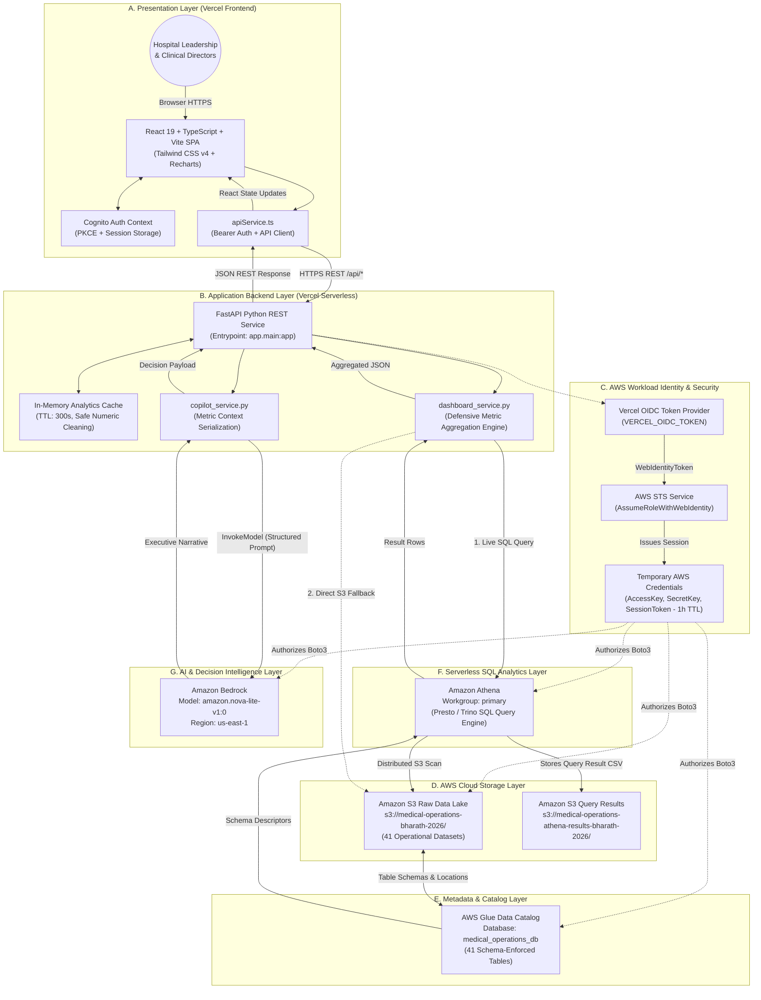
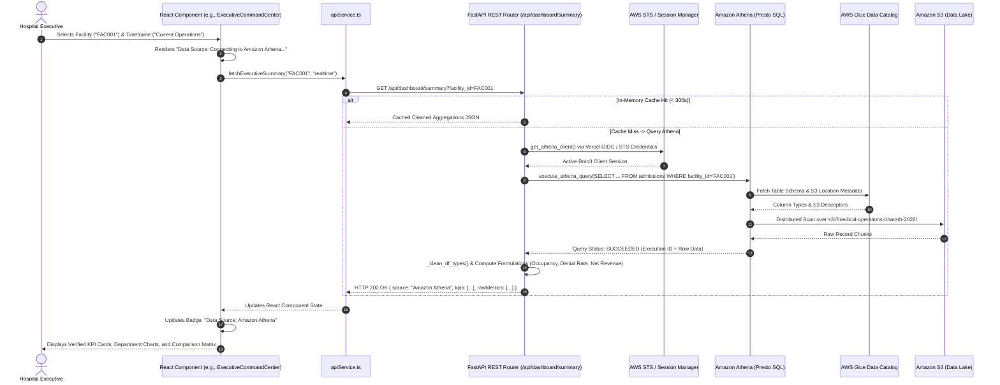

<div align="center">

# 🏥 MedOps Intelligence & Automation

### Healthcare Operations Intelligence Dashboard with Decision Analytics

*An enterprise-grade, cloud-native healthcare operations intelligence platform that centralizes distributed hospital data across 5 regional facilities to drive operational analytics, executive KPI monitoring, serverless cloud query execution, and AI-assisted decision intelligence.*

---

[](https://development-of-healthcare-operation.vercel.app)
[](https://github.com/kummariBharath/Development-of-Healthcare-Operations-Intelligence-Dashboard-with-Decision-Analytics)
[](https://www.python.org/)
[](https://fastapi.tiangolo.com/)
[](https://react.dev/)
[](https://www.typescriptlang.org/)
[](https://vitejs.dev/)
[](https://aws.amazon.com/cognito/)
[-569A31?style=for-the-badge&logo=amazons3&logoColor=white)](https://aws.amazon.com/s3/)
[-8C4FFF?style=for-the-badge&logo=amazonwebservices&logoColor=white)](https://aws.amazon.com/glue/)
[](https://aws.amazon.com/athena/)
[-0052CC?style=for-the-badge&logo=amazonwebservices&logoColor=white)](https://aws.amazon.com/bedrock/)
[](https://development-of-healthcare-operation.vercel.app)
[](#license)

<br/>


</div>

---

## 📑 Table of Contents

- [1. Executive Overview](#1-executive-overview)
- [2. Operational Challenge vs. Platform Solution](#2-operational-challenge-vs-platform-solution)
- [3. End-to-End System Architecture](#3-end-to-end-system-architecture)
- [4. Vercel Deployment & Workload Identity Architecture](#4-vercel-deployment--workload-identity-architecture)
- [5. Data Engineering & Query Execution Architecture](#5-data-engineering--query-execution-architecture)
- [6. Resilient Analytics & Data Source Architecture](#6-resilient-analytics--data-source-architecture)
- [7. Frontend → Backend → AWS Execution Flow](#7-frontend--backend--aws-execution-flow)
- [8. AI Decision Intelligence: Provider-Independent Architecture (Google Gemini & Amazon Bedrock)](#8-ai-decision-intelligence-provider-independent-architecture-google-gemini--amazon-bedrock)
- [9. Authentication & User Access Architecture](#9-authentication--user-access-architecture)
- [10. Security Perimeter & Credential Isolation](#10-security-perimeter--credential-isolation)
- [11. Product Integrity & Execution Truthfulness (Phase 2A)](#11-product-integrity--execution-truthfulness-phase-2a)
- [12. Data-Source UX, Loading & Error Handling Architecture (Phase 2B & 2C)](#12-data-source-ux-loading--error-handling-architecture-phase-2b--2c)
- [13. Healthcare Data Model (41 Core Datasets)](#13-healthcare-data-model-41-core-datasets)
- [14. Analytics & Metric Computation Layer](#14-analytics--metric-computation-layer)
- [15. MedOps Command Suite (20 User-Facing Modules)](#15-medops-command-suite-20-user-facing-modules)
- [16. Internal & Developer Diagnostics](#16-internal--developer-diagnostics)
- [17. End-to-End Project Workflow](#17-end-to-end-project-workflow)
- [18. Technology Stack](#18-technology-stack)
- [19. Repository Structure](#19-repository-structure)
- [20. Architectural Answers to Core System Questions](#20-architectural-answers-to-core-system-questions)
- [21. Development Workflow & Engineering Standards](#21-development-workflow--engineering-standards)
- [22. Engineering Team](#22-engineering-team)
- [23. Data Privacy & Responsible Use](#23-data-privacy--responsible-use)
- [24. Getting Started & Local Setup](#24-getting-started--local-setup)
- [25. AWS Infrastructure & Cloud Configuration Guide](#25-aws-infrastructure--cloud-configuration-guide)
- [26. Performance & Scalability Considerations](#26-performance--scalability-considerations)
- [27. Product Roadmap & Milestone Tracking](#27-product-roadmap--milestone-tracking)
- [28. Engineering Principles](#28-engineering-principles)
- [29. Project Status, License & Acknowledgements](#29-project-status-license--acknowledgements)

---

## 1. Executive Overview

Modern healthcare delivery networks generate colossal volumes of operational and clinical data across emergency rooms, inpatient wards, surgical suites, pharmacy distribution points, revenue cycle billing platforms, and medical supply chains. However, hospital leadership routinely struggles with:

* **Siloed Departmental Systems**: Clinical EHRs, Laboratory Information Management Systems (LIMS), ERPs, and billing platforms operate in isolation without centralized analytics.
* **Delayed Retrospective Reporting**: Hospital administration relies heavily on delayed, manually compiled spreadsheets that hinder timely operational interventions.
* **Workforce Overburden & Capacity Bottlenecks**: Doctor and nursing schedules struggle to dynamically adapt to emergency spikes and unpredictable bed occupancy.
* **Revenue Leakage**: Coding discrepancies, insurance claim denials, and prolonged unbilled accounts receivable deplete operating margins.

**MedOps Intelligence** solves this fundamental operational gap. It serves as a unified healthcare operations intelligence platform that centralizes distributed hospital data across 5 regional healthcare facilities. Deployed globally on **Vercel** with a serverless **AWS data engineering and AI backend**, the platform transforms raw transactional healthcare records into actionable executive command visibility, decision analytics, and automated operational intelligence.

### Architectural Core: Implemented vs. Roadmap

To maintain strict engineering transparency, the table below establishes the explicit boundary between currently implemented production capabilities and planned roadmap items:

| Platform Capability Domain | Currently Implemented (Production) | Planned / Future Roadmap |
| :--- | :--- | :--- |
| **Application Hosting** | Hosted entirely on **Vercel** (Vite frontend + FastAPI backend service via `vercel.json` rewrites). | Dedicated multi-region edge clustering. |
| **AWS Cloud Workload Identity** | Zero static keys in cloud; **Vercel OIDC** token dynamically exchanged for temporary AWS credentials via **AWS STS** (`AssumeRoleWithWebIdentity`). | Cross-account IAM role assumption for external healthcare partners. |
| **User Authentication** | **Amazon Cognito Managed Login** with OAuth 2.0 Authorization Code Grant and **PKCE**; session stored in browser `sessionStorage`. | Multi-tier granular RBAC backend route enforcement (currently groups mapped to user profile). |
| **Primary Data Source** | **Amazon Athena** serverless SQL executing against **AWS Glue Data Catalog** (`medical_operations_db`) over **Amazon S3** data lake. | Snappy-compressed Apache Parquet automated conversion via AWS Glue ETL jobs. |
| **Resilient Fallback** | Automated fallback hierarchy: In-memory cache (300s TTL) → Amazon Athena → S3 direct read → Local CSV fallback. | Distributed Redis caching layer across edge regions. |
| **AI Decision Copilot** | **Amazon Bedrock** invoking `amazon.nova-lite-v1:0` in `us-east-1` with structured metric context and deterministic analytics fallback. | Fine-tuned clinical operational LLMs and multi-agent workflow coordinators. |
| **User-Facing Modules** | **20 dedicated operational modules** in primary navigation across 5 functional operational groups. | External third-party marketplace modules and HL7/FHIR live connectors. |
| **Developer Diagnostics** | Preserved internal `AWSCloudServicesHub.tsx` for direct Glue catalog schema inspection and interactive Athena SQL execution. | Embedded CloudWatch log streamer and Athena query cost optimizer console. |
| **Operational Execution** | Truthful informational state: simulated mock triggers (surge alerts, fake claim submissions, auto-POs) removed/reframed in Phase 2A. | Production integrations with hospital ERP/HL7 systems for genuine outbound execution. |

---

## 2. Operational Challenge vs. Platform Solution

| Healthcare Operational Challenge | MedOps Intelligence Architectural Solution |
| :--- | :--- |
| **Fragmented Departmental Data** | Centralized, schema-enforced AWS Data Lake housing 41 relational operational domains in Amazon S3 (`ap-south-1`). |
| **Manual & Latent Reporting** | Automated serverless SQL queries executed via Amazon Athena delivering aggregated metrics on demand. |
| **Executive Visibility Gaps** | Unified Executive Command Center aggregating hospital-wide throughput, census, and revenue across 5 facilities. |
| **Unpredictable Bed Utilization** | Inpatient bed occupancy tracking, admissions-to-discharge monitoring, and average length of stay (ALOS) computation. |
| **Workforce Scheduling Mismatches** | Doctor & Staff Intelligence correlating shift attendance, overtime hours, patient-to-staff ratios, and workload scores. |
| **Claims Denials & Financial Leakage** | Revenue Cycle Analytics uncovering top denial reason codes, outstanding accounts receivable, and net billing collections. |
| **Critical Stockouts & Supply Delays** | Pharmacy & Inventory Intelligence monitoring automated reorder thresholds, batch expirations, and vendor lead-times. |
| **Reactive Patient Experience Oversight** | Multi-channel Patient Experience analytics tracking Net Promoter Scores (NPS), CSAT ratings, and feedback sentiment. |

---

## 3. End-to-End System Architecture

The MedOps Intelligence platform follows a decoupled, cloud-native architecture combining a Vercel-hosted presentation and API layer with an AWS serverless data lake, query execution engine, and generative AI copilot:

### High-Level Conceptual Architecture

```
                    USER
                      │
                      ▼
            React + TypeScript + Vite
                MedOps Frontend
                      │
                      ▼
                 apiService.ts
                      │
                 HTTPS / REST
                      │
                      ▼
              FastAPI Backend
                      │
          ┌───────────┼─────────────┐
          │           │             │
          ▼           ▼             ▼
       AWS STS    Analytics       Bedrock
       via OIDC    Services          AI
          │           │
          │      ┌────┼─────┐
          │      ▼    ▼     ▼
          │   Athena Glue   S3
          │      │     │     │
          │      └─────┴─────┘
          │
          ▼
 Temporary AWS Credentials
```

### Complete Multi-Tier Mermaid Architecture



> [!IMPORTANT]
> **Production Boundary**: The architecture enforces complete client isolation. The browser-based React client never receives AWS access keys, secret keys, or IAM session tokens. All Athena queries and Bedrock invocations are mediated through authenticated FastAPI endpoints and validated against least-privilege IAM policies.

---

## 4. Vercel Deployment & Workload Identity Architecture

The entire MedOps Intelligence platform is deployed and served through **Vercel**, uniting the modern React frontend and the FastAPI backend service within a single unified domain and deployment lifecycle:

```
Browser
   ↓
Vercel Edge Network
   ├── React + Vite Frontend (Static Assets & Client Routing)
   └── FastAPI Backend Service (Python Serverless Runtime)
          ↓
   Vercel OIDC Token (VERCEL_OIDC_TOKEN)
          ↓
   AWS STS AssumeRoleWithWebIdentity (role: vercel-medical-operations)
          ↓
   Temporary AWS Credentials (1-Hour Session Token)
          ↓
   Amazon S3 · AWS Glue · Amazon Athena · Amazon Bedrock
```

### Key Deployment Characteristics

* **Unified Vercel Hosting**: Vercel hosts both the static React frontend and the Python FastAPI backend service configured via `vercel.json` rewrites (`/api/*` routes to the backend service).
* **AWS as Cloud Data Platform**: AWS is **not** the application hosting platform. AWS provides the data storage, catalog, serverless SQL query engine, and generative AI infrastructure.
* **No ECS/Fargate/ALB in Production**: Old containerized ECS, ECR, and Application Load Balancer experiments have been deprecated in favor of serverless Vercel hosting.
* **Vercel OIDC Workload Identity**: In production on Vercel, the backend automatically acquires a short-lived OIDC JWT from the Vercel execution environment. It presents this token to AWS STS via `assume_role_with_web_identity` to obtain scoped, temporary AWS credentials.
* **Zero Static AWS Credentials in the Browser**: The client browser never receives, stores, or handles AWS access keys. All cloud interactions occur server-side inside FastAPI.

---

## 5. Data Engineering & Query Execution Architecture

The core data engineering pipeline transforms 41 raw operational healthcare datasets into validated clinical and managerial KPIs:

```
Healthcare Operational Datasets (CSV)
        ↓
Amazon S3 Data Lake (s3://medical-operations-bharath-2026/)
        ↓
AWS Glue Data Catalog (Database: medical_operations_db)
        ↓
Amazon Athena (Serverless SQL Query Engine)
        ↓
FastAPI Analytics Services (dashboard_service.py)
        ↓
JSON REST API Response (/api/dashboard/*)
        ↓
React Dashboard Components (ExecutiveCommandCenter, etc.)
        ↓
KPI Cards · Dynamic Recharts · Drilldown Tables · Decision Intelligence
```

### Architectural Roles by Component

* **Amazon S3 (`ap-south-1`)**: The primary storage layer. Holds all 41 operational datasets partitioned logically by table name under immutable storage. Also maintains Athena query output manifests in a dedicated results bucket.
* **AWS Glue Data Catalog (`ap-south-2`)**: The metadata and schema repository. Enforces column definitions, standardizes data types, and registers table locations for `medical_operations_db`.
* **Amazon Athena (`ap-south-2` / Primary Workgroup)**: The serverless query engine. Executes ANSI SQL queries directly against S3 data using Presto/Trino distributed compute, incurring zero idle-server costs.
* **FastAPI Backend (`app/services/dashboard_service.py`)**: The analytical and transformation layer. Dispatches SQL queries, cleans data types defensively, performs clinical aggregations, and computes complex ratios.
* **React Frontend (`src/components/modules/`)**: The presentation and decision-support layer. Renders responsive scorecards, department comparative charts, and actionable operational insights.

---

## 6. Resilient Analytics & Data Source Architecture

To guarantee maximum system availability across varied network and deployment environments, MedOps Intelligence implements a multi-tier fallback architecture:

```
[ In-Memory Cache (TTL: 300s) ]
        │ (Miss / Expired)
        ▼
[ Amazon Athena (Primary Live Analytical Source) ]
        │ (Query Error / Athena Offline)
        ▼
[ S3 Direct Fallback (Where Implemented) ]
        │ (Bucket Inaccessible / Local Dev)
        ▼
[ Local Dataset Fallback (Where Implemented) ]
```

### Fallback Implementation Rules

1. **In-Memory Cache (First Priority)**: Repeated queries within a 300-second window are served instantly from thread-safe in-memory DataFrames, reducing Athena scan overhead and query latency.
2. **Amazon Athena (Primary Live Source)**: The production system dispatches distributed SQL queries against the AWS Glue Catalog. Successful responses set the verified data source to `Amazon Athena`.
3. **Direct S3 Read Fallback**: If Athena query execution encounters a throttling or connectivity barrier, analytical services fall back to reading the raw CSV directly from `s3://medical-operations-bharath-2026/raw/{table}/{table}.csv`.
4. **Local Development Fallback**: When running locally without active AWS credentials, the backend resolves the dataset from `dataset/medical_operations_core_v9_100k/` for offline developer productivity.

> [!NOTE]
> **Defensive Scope**: Not every operational module requires all four fallback tiers. Amazon Athena is the primary live analytical source for production workflows. If live data cannot be retrieved and fallbacks are exhausted, the platform surfaces an explicit error state rather than presenting unverified numbers.

---

## 7. Frontend → Backend → AWS Execution Flow

The sequence below illustrates the exact path data traverses from the user's browser down to AWS storage and back:



---

## 8. AI Decision Intelligence: Provider-Independent Architecture (Google Gemini & Amazon Bedrock)

MedOps Intelligence features a **Provider-Independent AI Architecture** designed to seamlessly bridge cloud AI inference with enterprise healthcare data telemetry.

```
React Frontend (Executive Command Center / AI Copilot Drawer / AI Agent Tab)
                             |
                             v
                 FastAPI Backend Service Layer
                             |
              +--------------+--------------+
              |                             |
              v                             v
    AWS Analytics Pipeline        Provider-Independent AI Service
    (S3 / Glue / Athena)          (app/services/ai_service.py)
              |                             |
              v                     +-------+-------+
    Verified Aggregate Metrics     |               |
              |                     v               v
              +--------------> [Google Gemini] [Amazon Bedrock]
                               (Temporary)     (AWS Native)
                                    |               |
                                    +-------+-------+
                                            |
                                            v
                              AI Executive Summary & Copilot
```

### 1. Purpose of the Google Gemini Integration
Amazon Bedrock model access enablement is currently pending cloud-side activation. To provide immediate, production-grade operational intelligence, **Google Gemini API** is integrated as the temporary primary AI provider using Google's official Python SDK (`google-genai`).

This integration strictly adheres to the following principles:
- **Zero AWS Regression**: S3 data storage, AWS Glue Data Catalog, Amazon Athena serverless queries, and IAM roles remain 100% active and untouched.
- **Provider-Independent Adapter**: An abstraction layer (`BaseAIProvider`, `GeminiProvider`, `BedrockProvider`) isolates provider specifics from healthcare business logic.
- **Strict Data Grounding**: Prompts contain **only aggregate verified numerical metrics** (admissions, ALOS, collections, denial rates, ED wait times, occupancy). Zero identifiable patient information (PHI) is ever transmitted.
- **Resilient Fallback**: If external LLM APIs experience rate limits, model retirement, or network timeouts, the system automatically falls back to **Deterministic Analytics Mode**, ensuring the executive dashboard never crashes.

### 2. Required Environment Variables

Configure these variables in your backend environment file (`backend/.env`):

| Variable | Description | Default / Example | Security Requirement |
| :--- | :--- | :--- | :--- |
| `AI_PROVIDER` | Active AI provider (`gemini` or `bedrock`) | `gemini` | Non-secret |
| `GEMINI_API_KEY` | Google Gemini API Key | `your_gemini_api_key_here` | **Strict Secret**: Backend-only, never committed to Git, never exposed to frontend |
| `GEMINI_MODEL` | Gemini Model Identifier | `gemini-3.5-flash` | Non-secret |
| `AWS_BEDROCK_MODEL` | Amazon Bedrock Model Identifier | `amazon.nova-lite-v1:0` | Non-secret |
| `AWS_BEDROCK_REGION` | AWS Bedrock Service Region | `us-east-1` | Non-secret |

### 3. Secure API Key Configuration
- **Backend Isolation**: `GEMINI_API_KEY` is loaded exclusively inside the FastAPI backend runtime (`backend/app/config.py`).
- **Zero Browser Exposure**: The key is never referenced, packaged, or transmitted to Vite or the React client.
- **Git Protection**: `.env` and `backend/.env` are strictly excluded in `.gitignore` (`.env*`). A placeholder template is maintained in `.env.example`.
- **Log Sanitization**: Full prompts, raw tokens, and API credentials are never written to server logs or client error responses.

### 4. AI-Powered Executive Operational Summary
The primary AI capability is the **AI Operational Executive Briefing** integrated directly into the `ExecutiveCommandCenter`:
- **Real-Time Synthesis**: Dynamically queries Athena/S3 for active admissions, bed occupancy, collections, emergency wait times, and claims denial rates.
- **Structured Output**: Separates:
  1. *Executive Synthesis Brief*: High-level operations narrative.
  2. *Key Operational Trends*: Factual trends grounded in telemetry numbers.
  3. *Operational Concerns*: Early warning capacity thresholds and financial risks.
  4. *Management Recommendations*: Actionable administrative interventions.
  5. *Verified Observations*: Clear boundary separating empirical data from advisory recommendations.
- **Freshness & Provenance**: Displays reporting timeframe, data source provenance, and exact generation timestamps.
- **Interactive UI**: Includes loading skeletons, error states, and on-demand refresh triggers.

### 5. Known Limitations & API Quota Considerations
- **Demand Spikes (503 Unavailable)**: Public AI APIs may experience transient capacity spikes. The MedOps Gemini adapter implements automatic candidate model cascading (`gemini-3.5-flash` → `gemini-3.8-flash` → `gemini-flash-latest`) before initiating deterministic fallback.
- **Rate Limits (429 Quota Limits)**: If quota exhaustion occurs, the adapter catches the exception gracefully and serves a deterministic executive brief with an informational status banner.
- **Clinical Boundary**: Summaries are strictly operational and administrative; they do not diagnose patients or make clinical treatment decisions.

### 6. Future Migration Path to Amazon Bedrock
When AWS Bedrock access is enabled:
1. Update `backend/.env`:
   ```bash
   AI_PROVIDER=bedrock
   AWS_BEDROCK_MODEL=amazon.nova-lite-v1:0
   ```
2. Restart the FastAPI backend server.
3. The backend immediately routes inference through `BedrockProvider` using `boto3` and AWS credentials.
4. **Zero Frontend Changes Required**: The React dashboard, API client, and component interfaces remain completely unchanged.

---

## 9. Authentication & User Access Architecture

The platform cleanly separates **User Identity** from **AWS Workload Identity**:

### 1. User Authentication (Amazon Cognito)

```
User
  ↓
Amazon Cognito Managed Login (Hosted UI)
  ↓
Authorization Code Grant + PKCE (Proof Key for Code Exchange)
  ↓
Cognito Callback (/callback)
  ↓
React Authentication Context (AuthContext.tsx)
  ↓
Session Storage (ID Token & Access Token, Tab-Isolated)
  ↓
Authenticated MedOps Application Shell
```

* **Region**: `us-east-1`.
* **User Pool ID**: `us-east-1_fs4PnK0gh`.
* **Client ID**: `241i1ehcindfsu1d77953or31u` (Public Client, Secret-Free).
* **Supported Cognito User Groups**:
  * `ADMIN`: System Administrators and Cloud Operations Leads.
  * `VIEWER`: Read-only clinical and administrative observers.
  * `HOSPITAL_ADMIN`: Multi-facility operations executives (COO, CMO).
  * `ANALYST`: Healthcare data and financial analysts.
  * `DOCTOR`: Clinical department heads and attending physicians.
* **Storage Isolation**: Tokens are stored strictly in browser `sessionStorage`, isolating sessions per tab and avoiding persistent `localStorage` vulnerabilities.
* *Note on RBAC*: Current group claims are extracted into the user profile (`primaryRole`); extensive feature-level RBAC route gates remain scheduled on the roadmap.

### 2. Workload Identity (Vercel OIDC → AWS STS)

```
Vercel Backend Service
        ↓
OIDC Identity Token (VERCEL_OIDC_TOKEN)
        ↓
AWS STS AssumeRoleWithWebIdentity
        ↓
Temporary IAM Session Credentials (1 Hour)
        ↓
S3 · Glue · Athena · Bedrock
```

User authentication (Cognito) and backend workload identity (Vercel OIDC) are decoupled architectural mechanisms.

---

## 10. Security Perimeter & Credential Isolation

```
┌────────────────────────────────────────────────────────────────────────────────────────┐
│                              SECURITY PERIMETER & ISOLATION                            │
├────────────────────────────────────────────────────────────────────────────────────────┤
│  [ CLIENT / BROWSER ]                                                                  │
│       • Authenticates via Amazon Cognito Managed Login (Authorization Code + PKCE)     │
│       • Stores ID & Access Tokens in tab-scoped sessionStorage                         │
│       • ZERO static AWS Access Keys, Secret Keys, or Session Tokens                     │
│       ▼                                                                                │
│  [ FASTAPI BACKEND (VERCEL SERVERLESS) ]                                               │
│       • Receives browser requests with Bearer JWT                                      │
│       • Exchanges short-lived Vercel OIDC Token via AWS STS AssumeRoleWithWebIdentity  │
│       • Holds scoped 1-hour temporary credentials                                      │
│       ▼                                                                                │
│  [ AWS CLOUD SERVICES (LEAST-PRIVILEGE IAM ROLES) ]                                    │
│       • Amazon S3: Read-only access to raw datasets; Write access to Athena results   │
│       • AWS Glue: Read-only access to database schema metadata                         │
│       • Amazon Athena: Query execution scoped to 'primary' workgroup                   │
│       • Amazon Bedrock: Model invocation scoped to 'amazon.nova-lite-v1:0'             │
└────────────────────────────────────────────────────────────────────────────────────────┘
```

---

## 11. Product Integrity & Execution Truthfulness (Phase 2A)

During the **Phase 2A Product Integrity Audit**, all simulated or misleading action controls were systematically removed, disabled, or converted into truthful informational displays to guarantee full transparency:

| Previous Misleading UI Action | Truthful Current Implementation | Architectural Rationale |
| :--- | :--- | :--- |
| **"Trigger Surge Protocol"** | Informational alert card with operational staffing guidance. | Platform does not dispatch hospital-wide automated paging. |
| **"Revenue Leakage Scan"** | Real-time Athena financial variance aggregation table. | Analytics are continuously computed rather than triggered as mock scans. |
| **"Submit Clean Claims Batch"** | Truthful claims review scorecard with denial risk indicators. | Platform does not interface with live EDI 837 clearinghouses. |
| **"Dispatch STAT Result Alerts"** | Visual turnaround time (TAT) monitoring and abnormal gauges. | Outbound clinical SMS/pager dispatch is not connected to production EHRs. |
| **"Trigger AI Auto-Reorder POs"** | Inventory reorder warning lists with deficit calculations. | Automatic purchase order creation in ERPs requires human approval. |
| **"Simulated Extract & Match"** | Documented ICD-10 / CPT code reference table. | NLP extraction pipeline is documented in architecture, not mocked in UI. |
| **"Attach to Claim" / "Audit Claim"** | Static compliance checklists and status tags. | Claim editing is restricted to primary hospital billing systems. |
| **"Quality Inspect / Flow Logistics"** | Descriptive incident summaries and inspection checklists. | Mock button clicks converted to static operational audit records. |
| **Fake AlertsModal Operational Triggers** | Informational alert history browser. | Removed fake action buttons that produced simulated success toasts. |
| **Fake Custom KPI Builder Persistence**| Read-only metric catalog view. | Eliminated simulated KPI creator that lacked persistent database storage. |

---

## 12. Data-Source UX, Loading & Error Handling Architecture (Phase 2B & 2C)

The Phase 2B and Phase 2C initiatives overhauled data states, navigation, and error resiliency across the entire user interface:

### 1. Navigation Refinement (Phase 2B)
* The primary navigation was refined to **20 dedicated user-facing operational modules**.
* Misleading terminology such as **"Real-Time Live Stream"** was replaced across headers, filters, and cards with **"Current Operations"**, truthfully reflecting near-real-time batch queries.

### 2. Truthful Loading & Data-Source Indicators (Phase 2C)
* **Initial Loading State**: Replaced misleading initial `Data Source: Local Dataset` badges with an explicit state:
  $$\text{Data Source: Connecting to Amazon Athena...}$$
* **Standardized Athena Loading Messages**: Every operational module displays a descriptive loading notice:
  * *Loading patient operations analytics from Amazon Athena...*
  * *Loading physician & staffing analytics from Amazon Athena...*
  * *Loading emergency & critical care analytics from Amazon Athena...*
  * *Loading billing & revenue analytics from Amazon Athena...*
  * *Loading claims & denial intelligence from Amazon Athena...*
  * *Loading medical coding analytics from Amazon Athena...*
  * *Loading diagnostic laboratory analytics from Amazon Athena...*
  * *Loading pharmacy & inventory analytics from Amazon Athena...*
  * *Loading patient experience analytics from Amazon Athena...*
* **Verified Data-Source Badges**:
  * On Athena query success: `Data Source: Amazon Athena`
  * When S3 fallback engages: `Data Source: S3 Fallback`
  * In offline local development: `Data Source: Local Fallback`

### 3. Explicit Error Handling & Retry States
* **Executive Command Center**: If backend or Athena queries fail, the view renders an explicit error container displaying the error reason and a **Retry Request** button rather than silently presenting stale data.
* **Executive Analytics Hub**: If cross-domain tiles fail to load, an explicit alert container (*"Cross-Domain Analytics Unavailable"*) appears with a retry action, avoiding hardcoded fallback placeholders.
* **Static Reference Baseline**: The monthly departmental revenue trend chart in the Executive Command Center is explicitly labeled **"Static Reference Baseline"**, documenting it as a multi-specialty reference benchmark rather than dynamic Athena telemetry.

---

## 13. Healthcare Data Model (41 Core Datasets)

> [!IMPORTANT]
> **Architectural Distinction**: Do not confuse the **41 healthcare data tables** with the **20 user-facing modules**. The 41 tables represent the underlying relational data model cataloged in AWS Glue; the 20 modules represent the React presentation and command suite.

```
┌─────────────────────────────────────────────────────────────────────────────────────────────────┐
│                           HEALTHCARE DATA MODEL - 41 CORE DATASETS                              │
├───────────────────────────────────┬─────────────────────────────────────────────────────────────┤
│ 1. Patient & Inpatient Flow (9)   │ patients · admissions · appointments · beds                 │
│                                   │ bed_movements · discharge_records · emergency_visits        │
│                                   │ icu_stays · patient_flow_events                             │
├───────────────────────────────────┼─────────────────────────────────────────────────────────────┤
│ 2. Clinical & Workforce (9)       │ doctors · doctor_workload · staff · staff_workload          │
│                                   │ staff_attendance · nurse_shifts · surgeries                 │
│                                   │ departments · facilities                                    │
├───────────────────────────────────┼─────────────────────────────────────────────────────────────┤
│ 3. Diagnostics & Pharmacy (8)     │ lab_orders_results · lab_samples · lab_tests                │
│                                   │ lab_equipment · medicines · medicine_batches                │
│                                   │ prescriptions · pharmacy_dispensing                         │
├───────────────────────────────────┼─────────────────────────────────────────────────────────────┤
│ 4. Revenue Cycle & Finance (4)    │ billing · claims · financial_expenses · financial_monthly   │
├───────────────────────────────────┼─────────────────────────────────────────────────────────────┤
│ 5. Supply Chain & Vendors (6)     │ inventory · inventory_transactions · purchase_orders         │
│                                   │ supply_chain_purchase_orders · vendors · vendor_performance │
├───────────────────────────────────┼─────────────────────────────────────────────────────────────┤
│ 6. Quality, Experience & Safety(5)│ quality_audits · quality_incidents · corrective_actions     │
│                                   │ patient_feedback · patient_complaints                       │
└───────────────────────────────────┴─────────────────────────────────────────────────────────────┘
```

### Facilities Represented in Dataset
1. `FAC001` — **Hyderabad Central Hospital** (Hyderabad, Telangana)
2. `FAC002` — **Hyderabad West Clinic** (Hyderabad, Telangana)
3. `FAC003` — **Secunderabad Medical Center** (Secunderabad, Telangana)
4. `FAC004` — **Bengaluru Care Hospital** (Bengaluru, Karnataka)
5. `FAC005` — **Chennai Health Center** (Chennai, Tamil Nadu)

---

## 14. Analytics & Metric Computation Layer

The analytics engine converts raw tabular rows into validated healthcare metrics using defensive aggregation pipelines:

### Core Formulations & Mathematical Models

* **Bed Occupancy Rate (%)**:
  $$\text{Occupancy Rate} = \left(\frac{\text{Occupied Inpatient Beds}}{\text{Total Operational Bed Capacity}}\right) \times 100$$
* **Average Length of Stay (ALOS)**:
  $$\text{ALOS} = \frac{\sum_{i=1}^{N} (\text{Discharge Date}_i - \text{Admission Date}_i)}{N_{\text{discharges}}}$$
* **Claims Denial Rate (%)**:
  $$\text{Denial Rate} = \left(\frac{\text{Count of Denied Claims}}{\text{Total Claims Submitted}}\right) \times 100$$
* **Emergency Department Throughput & Wait Time**:
  $$\text{Avg ED Wait} = \frac{\sum (\text{Triage Time} - \text{Arrival Time})}{N_{\text{emergency visits}}}$$
* **Doctor Workload Index**:
  $$\text{Workload Index} = \sum (\text{Appointments Handled} \times w_1) + (\text{Surgeries Performed} \times w_2) + (\text{Inpatient Rounds} \times w_3)$$
* **Lab Test Turnaround Time (TAT)**:
  $$\text{Avg TAT (Hours)} = \frac{\sum (\text{Result Timestamp} - \text{Order Timestamp})}{N_{\text{completed tests}}}$$
* **Net Collection Ratio (%)**:
  $$\text{Net Collection Ratio} = \left(\frac{\text{Total Paid / Collected Amount}}{\text{Net Billed Amount}}\right) \times 100$$
* **Vendor On-Time Delivery (OTD %)**:
  $$\text{OTD \%} = \left(\frac{\text{Purchase Orders Delivered on or before Due Date}}{\text{Total Completed Purchase Orders}}\right) \times 100$$

### Defensive Data Cleaning Pipeline

The backend applies `_clean_df_types()` to all query results:
1. **Protected Identifier Protection**: IDs (`patient_id`, `facility_id`, `bill_id`) and dates are strictly shielded from numeric coercion.
2. **Known Numeric Extraction**: Strips commas, currency symbols (`$`, `₹`), and whitespace from financial metrics before converting to 64-bit floats.
3. **NaN Sanitization**: Missing or null metric cells are safely coerced to zero or neutral baselines to prevent frontend runtime exceptions.

---

## 15. MedOps Command Suite (20 User-Facing Modules)

The application navigation is organized into **20 dedicated user-facing operational modules** across 5 functional groups:

```
┌────────────────────────────────────────────────────────────────────────────────────────┐
│                        MEDOPS 20-MODULE COMMAND SUITE                                  │
├────────────────────────────────────────────────────────────────────────────────────────┤
│ 1. EXECUTIVE & CORE OPERATIONS                                                         │
│    01. Executive Command Center         03. Doctor & Staff Intelligence                │
│    02. Patient Operations               04. Emergency & Critical Operations            │
├────────────────────────────────────────────────────────────────────────────────────────┤
│ 2. REVENUE CYCLE & FINANCE                                                             │
│    05. Billing & Revenue Intelligence   07. Medical Coding & Documentation             │
│    06. Insurance & Claims Automation    08. Financial Intelligence (P&L)               │
├────────────────────────────────────────────────────────────────────────────────────────┤
│ 3. CLINICAL, QUALITY & SUPPLY                                                          │
│    09. Laboratory & Diagnostics         12. Patient Experience                         │
│    10. Pharmacy & Inventory             13. Supply Chain & Vendors                     │
│    11. Quality & Compliance                                                            │
├────────────────────────────────────────────────────────────────────────────────────────┤
│ 4. AI & AUTOMATION ENGINE                                                              │
│    14. AI & Predictive Intelligence     16. Data → AI → Auto Pipeline                  │
│    15. Workflow Automation Engine                                                      │
├────────────────────────────────────────────────────────────────────────────────────────┤
│ 5. GOVERNANCE & DASHBOARDS                                                             │
│    17. Medical Operations AI Agent      19. Security & Governance                      │
│    18. Executive Analytics Hub          20. Enterprise Integrations Hub                │
└────────────────────────────────────────────────────────────────────────────────────────┘
```

### Module Breakdown & Capabilities

| # | Module Name | Key Visualizations & Features | Operational Role |
| :---: | :--- | :--- | :--- |
| **01** | **Executive Command Center** | Operational health index, census curves, branch leaderboard, static reference trend. | Executive leadership visibility across all 5 facilities. |
| **02** | **Patient Operations** | Admission/discharge tracking, bed census gauges, transfer delay monitoring. | Inpatient throughput optimization and bottleneck prevention. |
| **03** | **Doctor & Staff Intelligence** | Doctor clinical loads, nurse-to-patient ratios, overtime tracking, burnout index. | Clinical staffing optimization and workload balancing. |
| **04** | **Emergency & Critical Ops** | ESI 1-5 triage acuity, ambulance bay arrivals, ED wait times, ICU occupancy. | Acute care surge monitoring and rapid resource allocation. |
| **05** | **Billing & Revenue Intelligence** | Gross billed vs. net realized collections, departmental splits, aging receivables. | Revenue cycle health and accounts receivable acceleration. |
| **06** | **Insurance & Claims Automation** | Claims denial rate %, top denial reasons, payer mix breakdown, appeal scores. | Denial management and reimbursement velocity. |
| **07** | **Medical Coding & Documentation** | ICD-10 / CPT code distribution, coding accuracy audits, unbilled accounts. | Documentation compliance and coding dispute reduction. |
| **08** | **Financial Intelligence (P&L)** | Departmental margins, EBITDA variance, operating costs vs. budget forecasts. | Long-term financial planning and capital expense control. |
| **09** | **Laboratory & Diagnostics** | Order turnaround time (TAT), sample backlog volumes, equipment utilization. | Diagnostic throughput and specimen tracking. |
| **10** | **Pharmacy & Inventory** | Reorder threshold warnings, stockout alerts, batch expirations, dispensing logs. | Medication safety and critical drug stock preservation. |
| **11** | **Quality & Compliance** | Clinical incident logs, root-cause classifications, audit compliance scores. | Patient safety governance and regulatory audit readiness. |
| **12** | **Patient Experience** | Net Promoter Score (NPS), CSAT ratings, complaint categories, sentiment trends. | Patient satisfaction oversight and service recovery. |
| **13** | **Supply Chain & Vendors** | Purchase order lifecycles, vendor on-time delivery (OTD %), unit cost variance. | Supplier performance evaluation and procurement monitoring. |
| **14** | **AI & Predictive Intelligence** | Predictive admission surge forecasts, bed occupancy risk projections. | Machine learning-assisted capacity forecasting. |
| **15** | **Workflow Automation Engine** | Rule-based trigger evaluation, threshold alerts, clinical routing workflows. | Operational trigger analysis and escalation paths. |
| **16** | **Data → AI → Auto Pipeline** | Visual representation of closed-loop data ingestion, modeling, and automated actions. | Data lifecycle and automation auditability. |
| **17** | **Medical Operations AI Agent** | Interactive natural-language prompt interface with grounded evidence cards. | Conversational operational decision support. |
| **18** | **Executive Analytics Hub** | Embedded reporting workspace with cross-domain report views and dynamic slicers. | Executive report consumption and multi-report switching. |
| **19** | **Security & Governance** | Zero-trust permission policies, IAM role mappings, HIPAA audit logging controls. | Access governance and compliance posture verification. |
| **20** | **Enterprise Integrations Hub** | EHR, LIMS, ERP, and clearinghouse interface health and API connection status. | Systems interoperability and data pipeline health. |

---

## 16. Internal & Developer Diagnostics

### AWS Cloud Services Hub (`src/components/modules/AWSCloudServicesHub.tsx`)

The component `AWSCloudServicesHub.tsx` remains preserved within the repository codebase as a specialized internal tool.

* **Genuine Technical Functionality**:
  * Live **AWS Glue Catalog Inspection**: Fetches real table schemas, column data types, and record locations for `medical_operations_db`.
  * Real-Time **Athena SQL Console**: Dispatches ad-hoc SQL queries directly to Amazon Athena and displays tabular results, execution time, and scanned data volume.
  * **AWS Cloud Health Probe**: Connects to `/api/health` to verify connectivity status across S3, Glue, Athena, and Bedrock.
* **Scope & Design Decision**: AWS Cloud Services Hub was deliberately excluded from the primary user-facing navigation suite. Hospital executives, doctors, and operational managers require clinical and financial intelligence rather than an AWS infrastructure management console. The component is maintained exclusively for developer verification and technical demonstrations.

---

## 17. End-to-End Project Workflow

```
1. Dataset Preparation     --> 41 healthcare operational CSV datasets generated and validated.
2. Cloud Storage           --> Staged in Amazon S3 (s3://medical-operations-bharath-2026/).
3. Metadata Cataloging     --> AWS Glue registers 41 schema-enforced tables in medical_operations_db.
4. Serverless Querying     --> Amazon Athena executes distributed Presto SQL queries on demand.
5. Workload Identity       --> Vercel OIDC generates token; AWS STS grants temporary credentials.
6. Metric Aggregation      --> FastAPI applies safe numeric cleaning and computes operational KPIs.
7. API Communication       --> React calls FastAPI REST endpoints via apiService.ts over HTTPS.
8. Dashboard Rendering     --> React 19 renders KPI cards, interactive Recharts, and drilldowns.
9. AI Decision Copilot     --> Amazon Bedrock (amazon.nova-lite-v1:0) generates strategic summaries.
10. User Authentication    --> Amazon Cognito Managed Login authenticates users via PKCE.
11. Production Hosting     --> Vercel serves the unified frontend and backend deployment.
12. Operational Action     --> Hospital leadership leverages verified metrics to drive tactical decisions.
```

---

## 18. Technology Stack

### Frontend Architecture
* **React 19**: Modern declarative component model with concurrent rendering features.
* **TypeScript 5.x / 6.x**: Strict static type safety across shared domain interfaces.
* **Vite 8.3**: Lightning-fast build tooling, HMR, and optimized production bundling.
* **Tailwind CSS v4**: Utility-first responsive styling with custom clinical dark theme.
* **Recharts**: Composable charting library for responsive time-series and area charts.
* **Lucide React**: Clean, semantic medical and operational iconography.

### Backend & Analytics Services
* **Python 3.10 / 3.12 / 3.14**: High-performance backend execution environment.
* **FastAPI 4.2.0**: Asynchronous Python web framework with automatic OpenAPI docs.
* **Uvicorn**: High-throughput ASGI server.
* **Pydantic**: Robust runtime schema validation and configuration management.
* **Pandas**: Fast in-memory tabular manipulation and defensive aggregation.
* **Boto3**: Official AWS SDK for Python mediating S3, Glue, Athena, Bedrock, and STS.

### Cloud Data & AI Infrastructure (AWS)
* **Amazon S3**: Scalable object storage for raw operational data and Athena results.
* **AWS Glue**: Centralized Data Catalog managing schemas for 41 tables.
* **Amazon Athena**: Serverless Presto/Trino SQL query execution engine.
* **Amazon Bedrock**: Managed foundation model runtime hosting `amazon.nova-lite-v1:0`.
* **AWS STS / IAM**: Secure Token Service providing short-lived credentials via role assumption.

### Identity & Access Management
* **Amazon Cognito**: Managed Login, User Pools, and OAuth 2.0 Authorization Code Grant + PKCE.
* **Vercel OIDC**: OpenID Connect workload federation for secretless AWS authentication.

### Deployment & Hosting
* **Vercel**: Global edge hosting for frontend static assets and serverless Python API.

---

## 19. Repository Structure

```text
Development-of-Healthcare-Operations-Intelligence-Dashboard-with-Decision-Analytics/
├── backend/                               # FastAPI Python Backend Service
│   ├── app/
│   │   ├── aws/                           # Boto3 Cloud Connectors & Client Factories
│   │   │   ├── athena.py                  # Athena query execution & result polling
│   │   │   ├── bedrock.py                 # Amazon Bedrock Nova Lite LLM invocation
│   │   │   ├── glue.py                    # AWS Glue Data Catalog table inspectors
│   │   │   ├── s3.py                      # S3 bucket health & object scanners
│   │   │   └── session.py                 # Vercel OIDC STS assume_role_with_web_identity
│   │   ├── routes/                        # Modular FastAPI REST Endpoint Routers
│   │   │   ├── athena.py                  # Raw Athena query execution API
│   │   │   ├── copilot.py                 # Bedrock decision-support copilot API
│   │   │   ├── dashboard.py               # Operational intelligence REST endpoints
│   │   │   ├── glue.py                    # Glue Data Catalog metadata API
│   │   │   └── health.py                  # Multi-service cloud health probe
│   │   ├── services/                      # Analytical Core & Computation Engines
│   │   │   ├── copilot_service.py         # AI prompt crafting & context serialization
│   │   │   └── dashboard_service.py       # 3,300+ lines of robust metric aggregations
│   │   ├── config.py                      # Environment settings & region configurations
│   │   └── main.py                        # FastAPI application entrypoint & middleware
│   ├── Dockerfile                         # Container build definition for backend
│   └── requirements.txt                   # Python dependencies (FastAPI, Boto3, Pandas)
├── dataset/                               # Healthcare Operational Data Assets
│   └── medical_operations_core_v9_100k/   # 41 Relational CSV Tables (100k records)
│       ├── admissions.csv
│       ├── appointments.csv
│       ├── billing.csv
│       ├── claims.csv
│       ├── doctors.csv
│       ├── facilities.csv
│       ├── inventory.csv
│       ├── lab_orders_results.csv
│       ├── medicines.csv
│       ├── patients.csv
│       └── ... (41 CSV datasets total)
├── public/                                # Static Web Assets
│   ├── favicon.svg
│   └── icons.svg
├── src/                                   # React 19 + TypeScript Frontend Source
│   ├── assets/
│   │   └── hero.png                       # Dashboard preview graphic
│   ├── components/
│   │   ├── auth/                          # Amazon Cognito Authentication Views
│   │   │   ├── AuthErrorScreen.tsx
│   │   │   ├── AuthLoadingScreen.tsx
│   │   │   └── UserAccountMenu.tsx
│   │   ├── copilot/                       # AI Copilot floating drawer & chat UI
│   │   │   └── AICopilotDrawer.tsx
│   │   ├── layout/                        # Core application shell
│   │   │   ├── Header.tsx                 # Facility filter & "Current Operations" selector
│   │   │   └── Sidebar.tsx                # 20-module grouped navigation sidebar
│   │   ├── modals/                        # Drilldown & interactive dialogs
│   │   │   ├── AlertsModal.tsx
│   │   │   ├── CustomKPIBuilderModal.tsx
│   │   │   └── EnterpriseDrilldownModal.tsx
│   │   └── modules/                       # 20 Core Healthcare Intelligence Views + Diagnostics
│   │       ├── AIPredictiveIntelligence.tsx
│   │       ├── AutomationPipelineVisualizer.tsx
│   │       ├── AWSCloudServicesHub.tsx    # Preserved developer diagnostics component
│   │       ├── BillingRevenueIntelligence.tsx
│   │       ├── DoctorStaffIntelligence.tsx
│   │       ├── EmergencyCriticalOperations.tsx
│   │       ├── ExecutiveCommandCenter.tsx # Primary executive view (Phase 2C loading/error)
│   │       ├── FinancialIntelligence.tsx
│   │       ├── InsuranceClaimsAutomation.tsx
│   │       ├── IntegrationsHub.tsx
│   │       ├── LaboratoryDiagnostics.tsx
│   │       ├── MedicalCodingDocumentation.tsx
│   │       ├── MedicalOpsAIAgentTab.tsx
│   │       ├── PatientExperience.tsx
│   │       ├── PatientOperations.tsx
│   │       ├── PharmacyInventory.tsx
│   │       ├── PowerBIDashboardHub.tsx    # Executive Analytics Hub
│   │       ├── QualityCompliance.tsx
│   │       ├── SecurityGovernance.tsx
│   │       ├── SupplyChainVendor.tsx
│   │       └── WorkflowAutomationEngine.tsx
│   ├── config/
│   │   └── cognitoConfig.ts               # Amazon Cognito OAuth2 / PKCE configuration
│   ├── context/
│   │   └── AuthContext.tsx                # React authentication context provider
│   ├── data/
│   │   └── mockData.ts                    # Offline fallback datasets & reference baselines
│   ├── services/
│   │   ├── apiService.ts                  # REST API client connecting to FastAPI
│   │   ├── awsService.ts                  # Client-side AWS interfaces
│   │   └── cognitoAuth.ts                 # PKCE string generation & token decoding
│   ├── types/
│   │   └── index.ts                       # Shared TypeScript domain interfaces
│   ├── App.css
│   ├── App.tsx                            # Root application component & module router
│   ├── index.css                          # Tailwind CSS imports & theme tokens
│   └── main.tsx                           # React DOM mount point
├── package.json                           # Frontend Node.js dependencies & scripts
├── policy-v2.json                         # Enhanced IAM Policy with S3 Athena Results
├── policy.json                            # Base IAM Policy
├── vercel.json                            # Vercel deployment routing & service configuration
├── vite.config.ts                         # Vite build configuration & plugins
└── README.md                              # Complete current-state project documentation
```

---

## 20. Architectural Answers to Core System Questions

To assist engineering reviews and technical assessments, the table below provides explicit answers to fundamental architectural questions:

| # | Architectural Question | Engineering Implementation Answer |
| :---: | :--- | :--- |
| **1** | **Where does the frontend run?** | Built with React 19 + Vite and hosted on **Vercel's Edge Network** as a static single-page application. |
| **2** | **Where does the backend run?** | Runs as a serverless Python FastAPI service hosted on **Vercel**, defined in `vercel.json` and routed via `/api/*`. |
| **3** | **How does React communicate with FastAPI?** | React calls FastAPI via `src/services/apiService.ts` using standard HTTPS REST calls, injecting Cognito Bearer tokens into request headers. |
| **4** | **How does FastAPI authenticate to AWS?** | Uses **Vercel OIDC** in production: exchanges `VERCEL_OIDC_TOKEN` with AWS STS via `assume_role_with_web_identity` to obtain scoped temporary credentials. |
| **5** | **Where is healthcare data stored?** | Stored as 41 structured CSV datasets in an **Amazon S3 Data Lake** (`s3://medical-operations-bharath-2026/`) in `ap-south-1`. |
| **6** | **How is it cataloged?** | Cataloged by **AWS Glue Data Catalog** within the database `medical_operations_db` in `ap-south-2`, establishing schema column definitions and data types. |
| **7** | **How does Athena query it?** | Dispatches serverless ANSI SQL queries via Boto3 against `medical_operations_db`, scanning S3 CSV objects and writing output manifests to a dedicated Athena results bucket. |
| **8** | **How does the data reach React?** | Athena returns row dictionaries to FastAPI → FastAPI sanitizes numerics and calculates KPIs → serializes JSON payload → `apiService.ts` delivers to React component state. |
| **9** | **Where does AI inference happen?** | In **Amazon Bedrock** (`us-east-1`) running `amazon.nova-lite-v1:0`, with deterministic fallback if Bedrock is in standby or throttled. |
| **10** | **How are users authenticated?** | Via **Amazon Cognito Managed Login** with OAuth 2.0 Authorization Code Grant and PKCE. Tokens are isolated in `sessionStorage`. |
| **11** | **What are the 20 user-facing modules?** | 20 operational modules organized into 5 functional groups: Executive Command, Revenue Cycle, Clinical/Quality/Supply, AI Engine, and Governance. |
| **12** | **What is genuine versus simulated?** | Genuine: Athena SQL querying, Glue cataloging, S3 storage, Bedrock inference, Cognito auth. Simulated: Phase 2A removed simulated surge/claim triggers; they are now informational cards. |
| **13** | **What happens if Athena is unavailable?** | The service evaluates in-memory cache, then direct S3 read, then local CSV fallback. If all fail, an explicit error state is rendered with a retry button. |
| **14** | **How are errors surfaced?** | React displays visual alert cards with explicit error messages and "Retry Request" buttons (e.g., Executive Command Center and Executive Analytics Hub). |
| **15** | **Why are AWS credentials never exposed to the browser?** | The browser never holds IAM keys or STS tokens. All AWS calls occur within the server-side FastAPI runtime mediated by Vercel OIDC. |
| **16** | **What is Vercel responsible for?** | Hosts both the React Vite frontend and the serverless FastAPI backend service, managing DNS, edge caching, and OIDC token generation. |
| **17** | **What is AWS responsible for?** | Provides data lake storage (S3), metadata cataloging (Glue), serverless SQL query execution (Athena), generative AI (Bedrock), and identity management (Cognito/STS). |
| **18** | **Why is AWS Cloud Services not a primary user-facing module?** | It is an infrastructure management and SQL diagnostic console. It was moved to internal developer diagnostics so the primary product remains focused on healthcare operations. |

---

## 21. Development Workflow & Engineering Standards

The project follows a standard GitHub Flow model designed for velocity, automated code quality checks, and clean version control:

```
Main Branch (Production on Vercel)
       │
       ├──> Create Feature Branch (`feature/analytics-enhancement`)
       │           │
       │           ├──> Implement Changes & Clean Code
       │           ├──> Run Static Linters (`oxlint`, `mypy`)
       │           ├──> Commit with Conventional Commits
       │           └──> Push to GitHub
       │
       └──> Open Pull Request (PR) -> Automated Validation -> Merge to Main -> Vercel Auto-Deploy
```

### Git Feature Branch Workflow

```bash
# 1. Clone repository
git clone https://github.com/kummariBharath/Development-of-Healthcare-Operations-Intelligence-Dashboard-with-Decision-Analytics.git
cd Development-of-Healthcare-Operations-Intelligence-Dashboard-with-Decision-Analytics

# 2. Create and switch to a descriptive feature branch
git checkout -b feature/optimize-athena-queries

# 3. Develop, format, and lint
npm run lint

# 4. Commit using Conventional Commit specifications
git add .
git commit -m "feat(analytics): add adaptive polling interval to Athena query execution"

# 5. Push to origin and open a Pull Request
git push origin feature/optimize-athena-queries
```

### Commit Message Standards

Commits adhere to the [Conventional Commits](https://www.conventionalcommits.org/) specification:
* `feat:` A new user-facing capability or API endpoint
* `fix:` A bug fix or data typing resolution
* `refactor:` Code restructuring without behavioral change
* `docs:` Documentation improvements or diagram updates
* `perf:` Performance optimizations in queries or frontend rendering
* `chore:` Build scripts, dependency bumps, or tool adjustments

---

## 22. Engineering Team

| Team Member | Engineering Role | Focus Areas | GitHub Profile |
| :--- | :--- | :--- | :--- |
| **Kummari Bharath** | Project Lead & Cloud Architect | Cloud Architecture, Data Engineering, FastAPI Backend, AWS Glue, Athena, Vercel OIDC | [@kummariBharath](https://github.com/kummariBharath) |
| **Engineering Contributor** | Data & Analytics Engineer | Healthcare Data Modeling, Athena SQL Queries, Metric Computation | *Open for Collaboration* |
| **Frontend Contributor** | Full-Stack UI/UX Engineer | React 19, Tailwind CSS, Recharts Visualization, Cognito Integration | *Open for Collaboration* |

---

## 23. Data Privacy & Responsible Use

Given the healthcare orientation of this platform, rigorous data governance principles are upheld:

* **Synthetic Data Guarantee**: All 100,000 records across the 41 CSV tables (`admissions.csv`, `patients.csv`, `billing.csv`, etc.) represent **fully synthetic, de-identified data generated strictly for benchmarking, decision-analytics demonstration, and educational purposes**.
* **Zero Protected Health Information (PHI)**: No real patient names, social security numbers, government IDs, actual medical records, or live institutional patient charts are present in this repository.
* **Demonstration Scope**: This repository represents an operational prototype and reference architecture. Production deployment in a live clinical setting requires formal HIPAA / GDPR compliance validation, business associate agreements (BAAs) with AWS, and audit logging via AWS CloudTrail.

---

## 24. Getting Started & Local Setup

Follow these steps to run MedOps Intelligence locally on your workstation.

### Prerequisites
* **Python**: v3.10, v3.12, or v3.14 installed
* **Node.js**: v18.x or v20.x+ and `npm` installed
* **Git**: Installed and configured
* *(Optional)* **AWS CLI**: Configured if connecting to live AWS S3, Glue, and Athena. If AWS credentials are not configured, the platform automatically utilizes its built-in local development fallback engine.

---

### Step 1: Clone the Repository

```bash
git clone https://github.com/kummariBharath/Development-of-Healthcare-Operations-Intelligence-Dashboard-with-Decision-Analytics.git
cd Development-of-Healthcare-Operations-Intelligence-Dashboard-with-Decision-Analytics
```

---

### Step 2: Set Up & Launch the FastAPI Backend

Open a terminal and navigate to the `backend/` directory:

```bash
cd backend

# Create a virtual environment
python -m venv venv

# Activate the virtual environment
# Windows (PowerShell):
venv\Scripts\Activate.ps1
# Linux / macOS:
source venv/bin/activate

# Install Python dependencies
pip install -r requirements.txt

# Configure backend environment variables in backend/.env
# (Copy from .env.example and populate your keys safely)
# AI_PROVIDER=gemini
# GEMINI_API_KEY=your_gemini_api_key_here
# GEMINI_MODEL=gemini-3.5-flash

# Run automated backend & AI verification tests
python -m unittest tests/test_ai_integration.py

# Launch FastAPI development server
python -m uvicorn app.main:app --host 127.0.0.1 --port 8000 --reload
```

* Backend API will be live at: `http://127.0.0.1:8000`
* Interactive Swagger API documentation: `http://127.0.0.1:8000/docs`
* Multi-service cloud & AI health probe: `http://127.0.0.1:8000/api/health`
* Live AI Executive Summary endpoint: `http://127.0.0.1:8000/api/dashboard/ai-summary`

---

### Step 3: Set Up & Launch the React Frontend

Open a second terminal in the project root:

```bash
# Install frontend dependencies
npm install

# Start the Vite development server
npm run dev
```

* Application will be available at: `http://localhost:5173`

---

## 25. AWS Infrastructure & Cloud Configuration Guide

To connect the platform to your own AWS Cloud environment, follow this deployment sequence:

### 1. Amazon S3 Setup
* Create an S3 bucket for the data lake: `s3://your-hospital-operations-bucket/` (`ap-south-1`)
* Create a dedicated query results bucket: `s3://your-hospital-athena-results/`
* Upload the 41 CSV files from `dataset/medical_operations_core_v9_100k/` into individual folders named after each table (e.g., `s3://your-hospital-operations-bucket/raw/admissions/admissions.csv`).

### 2. AWS Glue Cataloging
* Navigate to **AWS Glue** > **Databases** > Create database `medical_operations_db` in `ap-south-2`.
* Create and run an **AWS Glue Crawler** targeting `s3://your-hospital-operations-bucket/raw/`, or define table schemas directly matching the column structures in the CSV files.

### 3. Amazon Athena Configuration
* Open **Amazon Athena** > **Settings** > Set **Query Result Location** to `s3://your-hospital-athena-results/`.
* Verify that workgroup `primary` is active.
* Test query execution:
  ```sql
  SELECT facility_id, count(*) AS total_admissions, avg(length_of_stay_days) AS avg_los
  FROM "medical_operations_db"."admissions"
  GROUP BY facility_id;
  ```

### 4. Amazon Bedrock Access
* In the AWS Bedrock console (`us-east-1`), verify model access for `amazon.nova-lite-v1:0`.

### 5. Backend Configuration (`backend/.env`)
Create `backend/.env` with your cloud identifiers:

```ini
AWS_REGION=ap-south-1
AWS_S3_REGION=ap-south-1
AWS_DATA_REGION=ap-south-2
AWS_BEDROCK_REGION=us-east-1

AWS_S3_BUCKET=your-hospital-operations-bucket
AWS_GLUE_DATABASE=medical_operations_db
AWS_ATHENA_WORKGROUP=primary
AWS_ATHENA_OUTPUT=s3://your-hospital-athena-results/
AWS_BEDROCK_MODEL=amazon.nova-lite-v1:0

# When running in local development without Vercel OIDC:
# AWS_ACCESS_KEY_ID=your_access_key
# AWS_SECRET_ACCESS_KEY=your_secret_key
```

---

## 26. Performance & Scalability Considerations

To scale MedOps Intelligence across enterprise hospital networks processing millions of operational records, the platform incorporates key architectural optimization pathways:

```
┌─────────────────────────────────────────────────────────────────────────────────────────────────┐
│                                    SCALABILITY ROADMAP                                          │
├───────────────────────────────┬─────────────────────────────────┬───────────────────────────────┤
│   STORAGE OPTIMIZATION        │   SERVERLESS QUERY PERFORMANCE  │   API & DASHBOARD ACCELERATION│
│   • Partitioning by facility  │   • Query result reuse cache    │   • Multi-tier in-memory TTL  │
│     and event date (YYYY/MM)  │   • Column projection pruning   │   • Edge response caching     │
│   • Conversion from CSV to    │   • Workgroup data scan limits  │   • Virtualized tables for    │
│     Snappy-compressed Parquet │     and cost governance alerts  │     high-cardinality listings │
└───────────────────────────────┴─────────────────────────────────┴───────────────────────────────┘
```

1. **Partitioning Strategy**: Partitioning S3 data by `facility_id` and `event_date` (`year=YYYY/month=MM/`) enables Athena queries to scan only targeted partitions, reducing query latency and AWS data scan costs by up to 90%.
2. **Columnar Parquet Storage**: Migrating historical raw CSV records to columnar Apache Parquet with Snappy compression minimizes storage footprint and accelerates Presto/Trino columnar scan speeds.
3. **In-Memory Cache Layer**: The FastAPI service maintains a thread-safe DataFrame cache with a 300-second TTL to prevent redundant Athena query executions during high-frequency dashboard navigation.
4. **Defensive Type Coercion**: Customized `_clean_df_types()` logic converts string-encoded currency amounts and quantities to native 64-bit numerics, preventing runtime string concatenation errors during aggregation.

---

## 27. Product Roadmap & Milestone Tracking

### Phase 1 — Core Data Lake & Analytics Platform `[COMPLETED]`
- [x] Ingestion & modeling of 41 healthcare operational datasets
- [x] AWS S3 Data Lake configuration with Glue Data Catalog integration
- [x] Amazon Athena serverless SQL execution pipeline with execution polling
- [x] FastAPI REST backend with defensive numeric aggregation and caching
- [x] React 19 + TypeScript + Tailwind CSS executive frontend suite
- [x] Preserved AWS Cloud Services Hub for live Glue schema inspection and Athena console
- [x] Zero-credentials Vercel OIDC identity federation with AWS STS

### Phase 2 — Decision Analytics, UX Truthfulness & Hardening `[IN PROGRESS]`
- [x] **Phase 2A Completed**: Removed/reframed simulated operational triggers into truthful informational states
- [x] **Phase 2B Completed**: Consolidated navigation to 20 user-facing modules and adopted "Current Operations" terminology
- [x] **Phase 2C Completed**: Truthful data source states, standardized Athena loading notices, and explicit error/retry handling
- [ ] Power BI DirectQuery integration via Athena ODBC/JDBC drivers
- [ ] Automated Parquet conversion pipeline via scheduled AWS Glue ETL jobs
- [ ] Granular backend RBAC route enforcement matching Cognito user groups

### Phase 3 — Real-Time Streaming & Enterprise Scale `[PLANNED]`
- [ ] Apache Kafka / Amazon Kinesis stream ingestion for sub-second telemetry
- [ ] Predictive machine learning models for patient readmission risk scoring
- [ ] Multi-hospital federated analytics across regional healthcare systems
- [ ] Automated clinical staffing optimization based on predictive census forecasts

---

## 28. Engineering Principles

The codebase and architecture adhere to strict core software engineering values:

* **Modularity**: Every module, router, and cloud connector is decoupled and adheres to the Single Responsibility Principle (SRP).
* **Least Privilege (PoLP)**: IAM roles and API scopes provide only the exact permissions needed for designated operations.
* **Separation of Concerns**: Complete decoupling of data storage (S3), metadata cataloging (Glue), query execution (Athena), business logic (FastAPI), and presentation (React).
* **Defensive Programming**: Resilient data handling with fallback dataset loading, NaN sanitization, and graceful degradation during cloud connectivity interruptions.
* **Truthfulness in UI**: Absolute alignment between user interface controls and actual backend execution capabilities.

---

## 29. Project Status, License & Acknowledgements

### Project Status


MedOps Intelligence is in **Active Production Deployment**. The core data lake, cataloging, serverless SQL query pipeline, FastAPI backend services, Amazon Bedrock copilot, Amazon Cognito PKCE authentication, and 20-module React command center are fully implemented, operational, and deployed live on Vercel.

### License

**License**: Proprietary / To Be Defined.  
All rights reserved by the repository maintainer. Usage guidelines, licensing terms, and distribution rights are currently under definition. For academic review, partnership, or enterprise demonstration inquiries, please contact the author.

### Acknowledgements & References

* **AWS Architecture Documentation**: Best practices from AWS Big Data and Serverless Analytics reference architectures (Amazon S3, AWS Glue, Amazon Athena, Amazon Bedrock, Amazon Cognito).
* **FastAPI Framework**: [FastAPI Documentation](https://fastapi.tiangolo.com/) by Sebastián Ramírez.
* **React & Vite**: [React](https://react.dev/) by Meta Open Source and [Vite](https://vitejs.dev/) by Evan You.
* **Healthcare Operations Analytics**: Industry benchmark metrics informed by the Healthcare Financial Management Association (HFMA) and Emergency Severity Index (ESI) triage protocols.

---

<div align="center">

Built with rigorous data engineering, cloud architecture, and modern analytics.

**Maintainer**: [Kummari Bharath](https://github.com/kummariBharath) · [MedOps Intelligence Repository](https://github.com/kummariBharath/Development-of-Healthcare-Operations-Intelligence-Dashboard-with-Decision-Analytics) · [Production Application](https://development-of-healthcare-operation.vercel.app)

</div>
